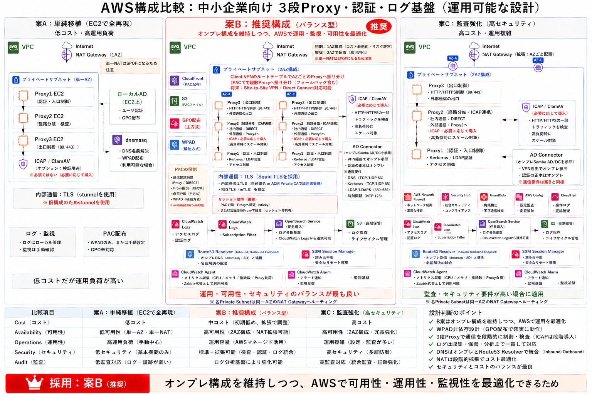
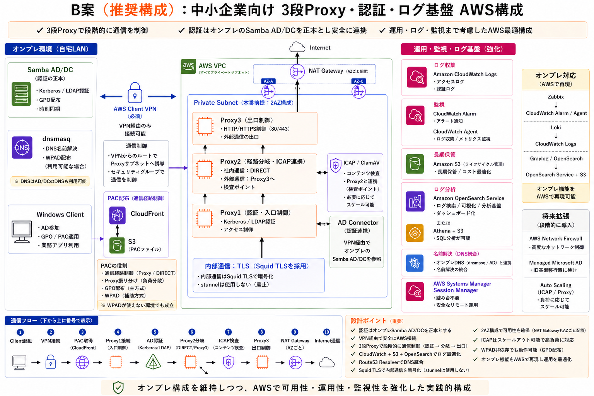
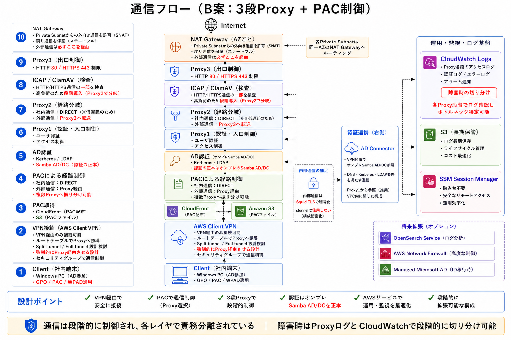
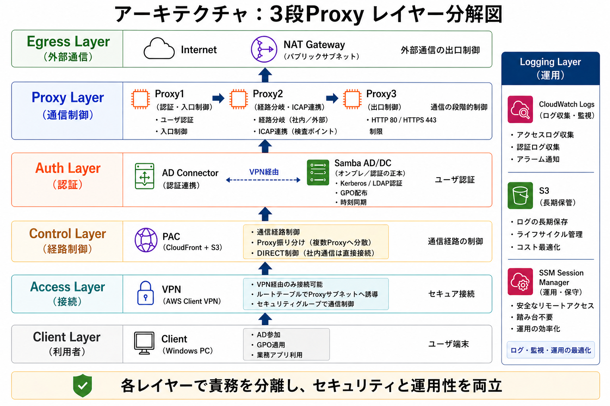

# AWS移行設計案：3段Proxy・認証・ログ基盤

Version: 2026-04-29
Author: gan2

> **本ページは、オンプレ / Docker Composeで構築した3段Proxy・認証・ログ基盤を、AWSへ移行するための設計案です。現時点ではAWS上での構築は未実施であり、次フェーズではTerraform / CloudFormation / Systems Manager Automation等を用いて、最小構成のIaC化および構築検証を進める予定です。**

---

## 0. このページで伝えたいこと

*1行サマリ: 「OSS で実装済みの責務分離を、AWS でも同じ判断軸で再設計できる」ことを示すページ。AWS 上の実機構築は未実施。*

### 0-1. このページの位置づけ

- 本ページは **AWS 実装済み成果物ではありません**。設計判断を整理した **設計案** です。
- 「Docker / OSS で実装済みの多段Proxy・認証・ログ基盤」を **AWS 上に移行する場合の構成と判断軸** を整理しています。
- **実装済みの証跡**（コンテナ稼働、ログ取得、PAC 経路分岐の動作確認）は [Verification](./verification.html) に集約しています。
- **再現性・自動化**（環境破棄〜約 25 分での再構築）は [Automation](./automation.html) を参照してください。
- 本ページは「設計の発想・判断軸・段階導入計画」を示し、面接で語れる形に整理することを目的としています。

### 0-2. 現時点の実装状況

| 項目 | 状況 | 確認できる場所 |
|---|---|---|
| OSS / Docker Compose 多段Proxy基盤 | **実装済み** | [Index](./index.html) / [Verification](./verification.html) |
| 認証・暗号化・経路制御・ログ・監視の責務分離 | **実装済み** | [Index](./index.html) / [Verification](./verification.html) |
| 環境破棄〜約 25 分での再構築 | **実装済み** | [Automation](./automation.html) |
| AWS 全体アーキテクチャ案（4 図面） | **設計済み** | 本ページ §1 〜 §4 |
| 構成案 A / B / C 比較・採用判断 | **設計済み** | 本ページ §3 |
| EC2 サイジング・コスト方針 | **仮説段階** | 本ページ §7 |
| Terraform / CloudFormation IaC | **未実施・次フェーズで構築予定** | 本ページ §8 / §9 |
| AWS 上での実機検証（疎通・ログ・Alarm） | **未実施・次フェーズで検証予定** | 本ページ §9 |
| クロスアカウント承認フロー | **設計済み・検証は次フェーズ** | 本ページ §8 |

> 表現は **「実装済み」「設計済み」「仮説段階」「未実施・次フェーズで検証予定」「将来拡張」** で使い分けています。

### 0-3. おすすめの閲覧順

採用担当者・技術面接官の双方に伝わる順序です。

1. **[README](https://github.com/Tanasu0417/code-of-life-public)** — このポートフォリオ全体のサマリ
2. **[Verification](./verification.html)** — OSS 基盤が **実際に動いている証拠**（スクショ／ログ）
3. **[Automation](./automation.html)** — **再現性・自動化** の整理（破棄〜25 分で復元）
4. **本ページ（AWS 移行設計案）** — OSS の責務分離を **AWS でどう設計するか**
5. **[Interview Pitch](./interview-pitch.html)** — 5 分・10 分プレゼン用の話順

### 0-4. Proxy 番号表記の注意

AWS 設計図（本ページ §1 の 4 枚）では、**Internet 側の出口を Proxy1**、**Client 側の入口を Proxy3** とする上→下フロー表現を採用しています。

| 役割 | OSS ポートフォリオの番号 | 本ページ（AWS 設計）の番号 |
|---|---|---|
| 入口（認証・ACL） | **Proxy1** | **Proxy3** |
| 中継（経路分岐・ICAP 連携） | Proxy2 | Proxy2 |
| 出口（外向け ACL・NAT 集約点） | **Proxy3** | **Proxy1** |

- 通信フローの実方向は **Client → Proxy3（入口）→ Proxy2（中継）→ ICAP → Proxy1（出口）→ NAT → Internet**
- OSS ページから読む方は §2 のオンプレ ↔ AWS 対応表で番号対応を確認できます

---

## 1. 図で見る設計概要

*1行サマリ: 4 枚の図面で全体像を把握する。文章は図に合わせて記述する。*

### 1-1. 構成比較図

- **案A：単純移植（EC2で全再現）** — 低コスト・高運用負荷。シンプル構成だが運用は手動中心
- **案B：推奨構成（バランス型）** — オンプレ構成を維持しつつ、AWS で可用性・運用性・監視性を最適化
- **案C：監査強化（高セキュリティ）** — Network Firewall / OpenSearch / Security Hub / AWS Config / CloudTrail / S3 Log Archive を組み合わせ。高コスト・高機能
- **採用：案 B** — 認証はオンプレ Samba AD/DC を正本、AWS Client VPN 経由のみ受付、PAC 配布で経路選択、3 段 Proxy で責務分離、AWS マネージドを必要なところに留める
- **将来検討**：AWS Network Firewall / Managed Microsoft AD / Auto Scaling

### 1-2. AWS全体構成図（B案）

図に存在する構成のみを記述します。

- **AWS Client VPN（必須）** — オンプレ環境（Samba AD/DC、dnsmasq、GPO、Windows Client）から VPC への唯一の到達経路
- **PAC（CloudFront + S3）** — 経路選択ファイルを CDN 配布、WPAD/PAC として配布
- **Private Subnet（2AZ）** に **3段Proxy** を配置：
  - **Proxy3：認証・入口制御** — Kerberos / LDAP 認証、入口 ACL、アクセス管理
  - **Proxy2：経路制御・ICAP連携** — 中継、DIRECT、TLS 再暗号化、検査ポイント
  - **Proxy1：出口制御** — HTTP / HTTPS（80 / 443）、出口 ACL
- **内部通信は Squid TLS を採用**（stunnel は使用しない）
- **ICAP / ClamAV** — Proxy2 と連携してコンテンツ検査
- **AD Connector** — VPN 経由でオンプレ Samba AD/DC を参照（認証の正本はオンプレに残置）
- **NAT Gateway（AZ ごと配置）** — Private Subnet からインターネットへの出口集約
- **運用・監視・ログ基盤**：Amazon CloudWatch Logs / Alarm / Agent、Amazon S3（ライフサイクル管理）、AWS Systems Manager Session Manager（踏み台不要）
- **Athena / OpenSearch Service** — ログ分析・全文検索の **拡張オプション**（必要時に段階導入）
- **将来検討**：AWS Network Firewall / Managed Microsoft AD / Auto Scaling

通信フロー（図下部の流れ）:
`Client → VPN接続 → PAC設定 → Proxy3（認証） → Proxy2（経路） → ICAP/ClamAV（検査） → Proxy1（出口） → NAT Gateway → Internet`

### 1-3. 通信フロー図

下から上へ通信が進みます。

1. **Client（Windows PC、GPO 配布済み）**
2. **AWS Client VPN** — VPN 以外の通信を遮断、認証 ID / MFA、ルートテーブルで Proxy3 方向へ中継
3. **PAC（経路選択）** — CloudFront + S3 から `proxy.pac` を取得、DIRECT or Proxy 振分
4. **AD認証（Kerberos / LDAP）** — AD Connector → Samba AD/DC 参照、アクセス管理
5. **Proxy3：認証・入口制御** — ユーザ認証、入口 ACL
6. **Proxy2：経路制御** — 中継、DIRECT、ICAP サービスへ転送、内部通信は Squid TLS で再暗号化
7. **ICAP / ClamAV：検査ポイント** — 不正検査・ウイルス検査・ファイルチェック
8. **Proxy1：出口制御** — HTTP / HTTPS（80 / 443）、出口 ACL
9. **NAT Gateway（Public Subnet）** — 外部接続点、出口を集約
10. **Internet** へ HTTP / HTTPS で到達

横断の **運用・監視・ログ基盤**：CloudWatch Logs（収集）→ CloudWatch Alarm（異常検知）→ S3（永続保管）+ SSM Session Manager（踏み台不要）。
**将来検討（段階導入）**：AWS Network Firewall / Managed Microsoft AD。

設計ポイント（図下部）：
- 通信は段階的に制御され、各レイヤで責務分離されている
- 障害発生時は Proxy ログを CloudWatch で段階的に切り分け可能

### 1-4. レイヤー分解図

責務を **7 レイヤ + Logging Layer（横断）** に分離します。

- **① Egress Layer（外部通信）** — NAT Gateway（パブリックサブネット内）→ Internet
- **② Inspection Layer（検査）** — ICAP / ClamAV、HTTP / HTTPS（80 / 443）、Squid TLS
- **③ Proxy Layer（通信制御）** — Proxy1（出口制御）→ Proxy2（経路制御・ICAP連携）→ Proxy3（認証・入口制御）。**内部通信は Squid TLS を採用（stunnel は使用しない）**
- **④ Auth Layer（認証）** — AD Connector が VPN 経由で Samba AD/DC（認証の正本）を参照、Kerberos / LDAP
- **⑤ Control Layer（経路制御）** — PAC（CloudFront + S3）、GPO / 政策ファイル、Split tunnel / Full tunnel
- **⑥ Access Layer（接続）** — AWS Client VPN
- **⑦ Client Layer（利用者）** — Windows PC、GPO 配布済み
- **Logging Layer（横断）** — CloudWatch Logs / S3 / SSM Session Manager

> 各レイヤで責務を分離し、セキュリティと運用性を両立する設計です。

---

## 2. 現行オンプレ構成と AWS 移行案の対応関係

*1行サマリ: 図に存在する要素のみを対応表で示す。OSS と AWS の Proxy 番号対応も併記。*

| 現行構成（オンプレ / Docker Compose） | AWS 構成（B案） | 採用理由 | 検証ポイント |
|---|---|---|---|
| Windows Client（社内端末） | クライアント側はそのまま、AWS には移さない | 既存端末ポリシー・GPO 配布をそのまま流用 | VPN クライアント配布、PAC 取得経路 |
| Samba AD/DC（オンプレ・正本） | **オンプレに正本を残置**、AWS は **AD Connector で VPN 経由参照** | 認証の正本を変えずに段階移行 | DNS / Kerberos / 時刻同期、AD Connector の設置サブネット |
| dnsmasq（社内 DNS / WPAD 補助） | **Route 53 Resolver / DNS Firewall** | マネージドな DNS 解決と DNS レイヤのフィルタ | Resolver Endpoint 配置、社内 DNS との整合 |
| WPAD / PAC（社内配布） | **PAC（CloudFront + S3）** | 静的配信で運用コスト低、CDN で大規模配布も対応 | PAC キャッシュ TTL、HTTPS 配布、社内 DNS との整合 |
| Proxy1（OSS：入口・分岐） | **EC2 + Squid（AWS Proxy3：認証・入口制御）** | 入口ACL・認証の責務を踏襲（番号は AWS 図に合わせて反転） | AD Connector 連携、認証失敗ログ集約 |
| Proxy2（OSS：分岐・DIRECT 受け） | **EC2 + Squid（AWS Proxy2：経路制御・ICAP連携）** | 経路分岐・ICAP 連携の責務を維持（番号は同じ） | ICAP 待ち時間、Proxy 間 SG 設計 |
| Proxy3（OSS：出口） | **EC2 + Squid（AWS Proxy1：出口制御）** | 出口 ACL と NAT GW 集約（番号は反転） | NAT GW のポート確保、宛先 ACL 反映フロー |
| stunnel（中継暗号化） | **不採用。Squid TLS で内部通信を暗号化** | TLS 終端を Squid に集約し、運用要素を減らす | TLS バージョン、証明書ローテーション運用 |
| ICAP / ClamAV | **EC2 上の ICAP / ClamAV** | 既存検査ロジックを継続利用 | 定義ファイル更新、メモリ使用率、スキャン遅延 |
| Loki（経路判定） | **CloudWatch Logs（Insights）** | 経路判定（access→cache）を CW Logs Insights で再現 | クエリ性能、ログ保存期間、コスト |
| Graylog（全文検索） | **Amazon OpenSearch Service**（Phase 3 の拡張） | 全文検索とダッシュボード、Athena は S3 への SQL 分析（Phase 2 でも採用可） | ノード数、ストレージ、ログ取り込みパイプライン |
| Zabbix（死活監視） | **CloudWatch Alarm**（CloudWatch Agent でメトリクス収集） | マネージドで運用負荷削減、SNS 通知へ接続容易 | アラーム閾値、誤検知率、通知先 |
| Bash 自動化（STEP0〜17） | **Terraform / CloudFormation + GitHub Actions + SSM Automation** | 宣言的構成で再現性、承認付き展開へ移行 | plan→apply の運用、ロールバック手順、ドリフト検出 |

---

## 3. 構成案 A / B / C の比較

*1行サマリ: 採用は B 案（バランス型）。コスト・可用性・運用負荷の総合判断。*

| 軸 | 案A: 単純移植 | 案B: 推奨（バランス型） | 案C: 監査強化 |
|---|---|---|---|
| Proxy 構成 | 1 ホストへ責務集約 | **3 段（Proxy1 / 2 / 3、2AZ）** | 3 段 + Network Firewall |
| 内部通信暗号化 | TLS（stunnel または Squid TLS） | **Squid TLS（stunnel は使用しない）** | Squid TLS + Network Firewall |
| NAT Gateway | 1 台 | 初期 1 台 / 標準 2 台（AZ ごと配置） | 2 台 |
| ログ集約 | CloudWatch Logs のみ | **CW Logs + S3（Phase 2）／+ Athena・OpenSearch（Phase 3 拡張）** | CW Logs + S3 + OpenSearch + Security Hub |
| 認証 | AD Connector | **AD Connector（オンプレ Samba AD/DC を正本参照）** | Managed AD + IAM Identity Center |
| 検査・監査 | なし | 必要に応じ GuardDuty 検討 | Network Firewall + Security Hub + GuardDuty + AWS Config + CloudTrail |
| 可用性 | 中（責務集約で切り分け困難） | **高（2AZ で継続）** | 高 |
| 月額コスト目安 | 中 | **中（バランス）** | 高 |
| 運用負荷 | 中（手動運用ベース） | **中** | 高 |
| 監査性 | 中 | **中（CW Logs + S3 + 必要時 OpenSearch）** | 高（フル監査ログ + 自動コンプラ評価） |
| 推奨場面 | 検証・学習 | **50〜300 名の標準業務** | 監査・証跡・コンプライアンス要求 |

**B 案を採用する根拠**

- A 案は低コストだが運用負荷が高く、障害切り分けが難しい
- C 案は高機能だがコスト・複雑性が高く、監査要件が明確でない段階では過剰
- B 案は **既存のオンプレ責務分離を維持しつつ AWS マネージドを活用**、段階的に C 案へ拡張できる
- 運用保守経験を AWS 設計に直接接続しやすい

---

## 4. 採用構成：B案を 3 つの Phase に分けて段階導入

*1行サマリ: いきなり全部入れない。検証コスト・運用負荷を理由に Phase 1 → 2 → 3 で段階導入。*

中小企業（50〜300 名規模）で **過剰構成** にならないよう、B 案を **Phase 1（最小）** → **Phase 2（推奨）** → **Phase 3（将来拡張）** の 3 段階に分けて導入します。

| 観点 | Phase 1: 最小構成（PoC） | Phase 2: 推奨構成（B案標準） | Phase 3: 将来拡張 |
|---|---|---|---|
| 目的 | **次に実装する AWS 最小構成**。CW Logs / SSM / S3 を含む基本動作を実機で確認 | 3 段 Proxy + 2AZ + AD Connector + PAC で **B 案の本来の姿** を構築 | 監査・検索・ID 基盤刷新が必要になった段階で拡張 |
| 起動目安 | 次フェーズ開始時 | Phase 1 検証後（ログ・SSM 動作確認後） | 業務適用後、要件発生時 |
| 主な構成 | VPC / Public・Private Subnet / SG / EC2 Proxy×1 / SSM Session Manager / CloudWatch Agent / S3 ログ保管 / IAM Role | 上記 + 2AZ 化 / 3 段 Proxy（Proxy1/2/3）/ ICAP・ClamAV / AD Connector / AWS Client VPN / PAC（CloudFront+S3）/ NAT Gateway / Athena | 上記 + OpenSearch Service / AWS Network Firewall / Managed Microsoft AD / Auto Scaling |

### 4-1. Phase 1：最小構成（次に実装する AWS 最小構成）

**目的**：AWS 上で最低限のログ収集と運用基盤が動作することを実機で確認する。

| 構成要素 | 設定の方針 | 検証ゴール |
|---|---|---|
| VPC | 1（10.0.0.0/16 等） | Subnet と Route Table が想定通りに作成される |
| Public Subnet × 1 | NAT Gateway 配置用 | Public ルート表に IGW が紐付く |
| Private Subnet × 1 | EC2 Proxy 配置 | Private ルート表に NAT が紐付く |
| Security Group | 最小限（VPN→EC2 / EC2→NAT のみ） | 不要な穴がないことを `iam simulate-principal-policy` で確認 |
| EC2 Proxy × 1 | 検証目的で **責務集約**（Squid 単体） | curl 経由で外部到達、access.log が残る |
| SSM Session Manager | EC2 IAM Role に `AmazonSSMManagedInstanceCore` 付与 | `aws ssm start-session` でログイン可能 |
| CloudWatch Agent | EC2 上に導入、`/var/log/squid/*` を CW Logs へ | LogGroup にイベントが届く |
| CloudWatch Logs | LogGroup 作成、保存期間 30 日想定 | Logs Insights で簡易検索が成功する |
| S3 ログ保管 | バケット作成（バージョニング有効） | CW Logs から S3 にエクスポート / Subscription Filter 経由で配信 |
| IAM Role（EC2用） | SSM + CloudWatch + S3 出力の最小権限 | 不要な権限を持たないことを simulate で確認 |

> Phase 1 では **OpenSearch / AD Connector / 3 段 Proxy / ICAP / Multi-AZ は導入しない**。最小構成で運用基盤を成立させることを優先します。

### 4-2. Phase 2：推奨構成（B案標準）

**目的**：OSS で実装済みの責務分離（入口・中継・出口・認証・検査）を AWS 上で再現し、業務利用に耐える構成にする。

| 構成要素 | Phase 1 からの追加・変更 | 役割 |
|---|---|---|
| AZ | 1AZ → **2AZ**（AZ-a / AZ-c） | AZ 障害時の業務継続 |
| Proxy EC2 | 1 台 → **3 段（Proxy3：入口 / Proxy2：中継 / Proxy1：出口）** | OSS の責務分離を AWS でも維持 |
| ICAP / ClamAV | 追加 | Proxy2 と連携してコンテンツ検査 |
| 内部通信暗号化 | 追加（**Squid TLS**、stunnel は使用しない） | Proxy 間の暗号境界 |
| AD Connector | 追加 | VPN 経由でオンプレ Samba AD/DC を参照 |
| AWS Client VPN | 追加 | クライアントの唯一の到達経路 |
| PAC 配布 | 追加（**CloudFront + S3**） | 経路選択を CDN 配布 |
| NAT Gateway | 1 台 → **2 台（AZ ごと配置）** | AZ 障害時の出口断を回避 |
| Route 53 Resolver / DNS Firewall | 追加 | dnsmasq 相当を AWS マネージドへ |
| Athena | 追加 | S3 ログへの SQL 分析（OpenSearch より低コスト） |
| CloudWatch Alarm | 強化 | 認証失敗率・出口エラー率・プロセス停止 |

> Phase 2 では **OpenSearch は導入しない**。検索は CW Logs Insights と Athena で代替し、コスト・運用負荷を抑えます。

### 4-3. Phase 3：将来拡張構成

**目的**：監査・検索・ID 基盤の要件が明確化した段階で、必要な拡張だけを段階的に追加する。

| 拡張項目 | 採用判断のトリガー | 効果 / コスト |
|---|---|---|
| **OpenSearch Service** | 全文検索・ダッシュボード要件、ログ分析者が複数になる | 効果：検索性能・可視化 / コスト：小規模クラスタでも月額数万円 |
| **AWS Network Firewall** | ネットワーク監査強化、宛先ベースの細かい制御要件 | 効果：DNS Firewall を超える L4-L7 制御 / コスト：時間課金 + 処理量課金 |
| **Managed Microsoft AD** | ID 基盤を AWS 側へ集約する経営判断 | 効果：AD Connector 不要 / コスト：固定月額 |
| **Auto Scaling**（Proxy） | 同時利用者の増加、急峻なピーク | 効果：スケール耐性 / コスト：管理オーバーヘッド |
| **Security Hub / GuardDuty / AWS Config** | コンプライアンス要件、監査証跡の自動評価 | 効果：自動コンプラ評価 / コスト：イベント量に応じた課金 |

---

## 5. 採用構成の設計判断

*1行サマリ: 図にある構成について「なぜそれを選ぶのか」を 9 観点で整理する。*

### 5-1. なぜ 3 段 Proxy なのか

- **Proxy3：認証・入口制御** — AD Connector 経由で Samba AD/DC を参照、入口 ACL、認証失敗の判定（最初の段階で検出）
- **Proxy2：経路制御・ICAP連携** — 中継、ICAP / ClamAV 連携、TLS 再暗号化、将来の検査機能の追加先
- **Proxy1：出口制御** — 出口 ACL、HTTP / HTTPS（80 / 443）、NAT GW への集約点
- **目的は冗長化ではなく責務分離による障害切り分け** — どの段で問題が起きたかをログで切り分けられる構造を AWS 上でも維持する

### 5-2. なぜ Proxy を Private Subnet に置くのか

- **外部から直接アクセスさせない** — Proxy にグローバル IP を持たせない
- **VPN 経由でのみ接続** — Client → Proxy3 への到達は AWS Client VPN を経由
- **Internet 向け通信は NAT Gateway に集約** — 出口を一点に絞ることで監査と制御が容易
- **Security Group で通信元・通信先を限定** — Proxy 間 / Proxy → NAT GW / Proxy → AD Connector を最小権限で制御

### 5-3. なぜ PAC なのか

- **社内通信は DIRECT** — VPC 内・社内向けは Proxy を経由せず効率化
- **外部通信は Proxy 経由** — インターネット向けのみ Proxy で集約制御
- **複数 Proxy への振り分け** — 3 段の入口（Proxy3）へ確実に向ける、将来の追加 Proxy へも動的分配
- **障害時・検証時の経路切替** — PAC の差し替えのみで経路を切替可能

### 5-4. なぜ AD Connector なのか

- **認証の正本は Samba AD/DC（オンプレ）に残す** — オンプレ ID 基盤を変更せずに段階移行
- **AWS 側は AD Connector で参照口を提供** — VPN 経由で Samba AD/DC を参照
- **Managed Microsoft AD は将来検討** — ID 基盤を AWS 側に集約する段階で再評価
- **連携検証は DNS / Kerberos / 時刻同期を含めて行う** — Kerberos 前提の SPN・逆引き・時刻ずれを検証対象とする

### 5-5. なぜ Squid TLS（stunnel 不採用）なのか

- **TLS 終端を Squid に集約** — Proxy2 の TLS 再暗号化を Squid 自身で処理し、運用要素を減らす
- **stunnel を運用から外す** — サイドカープロセスの監視・証明書管理・障害時切り分けを 1 段減らせる
- **Squid 単体で観測しやすい** — 内部通信の TLS 状態と access ログを同じ系で扱える
- **将来の AWS マネージド連携の選択肢を残す** — ACM / NLB TLS Listener への移行余地を残す

### 5-6. なぜ CloudWatch / S3 / SSM なのか（OpenSearch は段階導入）

- **CloudWatch Logs：ログ収集・障害調査** — Proxy / ICAP / VPN ログを統一的に集約
- **CloudWatch Alarm：異常検知** — 認証失敗率、出口エラー率、プロセス停止を即時検知
- **CloudWatch Agent：メトリクス収集** — Zabbix 相当の死活・リソース監視を AWS 側で受ける
- **S3：長期保管・ライフサイクル管理** — Standard → IA → Glacier で監査ログを安価に保管、SSM 操作証跡もここへ
- **SSM Session Manager：踏み台不要・SSH 鍵管理削減** — IAM 監査と CloudTrail で操作証跡を残す
- **OpenSearch は Phase 3 拡張** — 全文検索・ダッシュボード要件が明確化した段階で追加（Phase 1/2 では CW Logs Insights + Athena で代替）

### 5-7. なぜ B 案なのか

- **A 案は低コストだが運用負荷が高い** — 1 ホストに責務が集中し、障害切り分けが難しい
- **C 案は高機能だがコストと複雑性が高い** — 監査要件が明確でない段階では過剰
- **B 案は既存の強みを維持しつつ AWS 運用へ最適化できる** — 3 段 Proxy の責務分離を残しつつ、ログ・監視・運用は AWS マネージドへ寄せる
- **運用保守経験を AWS 設計に接続しやすい** — オンプレで身につけた切り分け観点をそのまま面接・実装で語れる

### 5-8. なぜ最初から全部入れないのか（段階導入の理由）

- **検証コストの抑制** — Phase 1 で運用基盤の動作を確認してから本構成を組む方が、設定漏れに気付きやすい
- **運用負荷の段階管理** — 一度に Multi-AZ + AD + OpenSearch を導入すると障害切り分けが難しい
- **障害時の切り分け容易性** — 単純構成で動作を確認した上で、要素を 1 つずつ足すと「どこで壊れたか」が明確
- **コスト適正化** — 全要素を最初から起動するとアイドル時の課金が大きい。利用実態を見て段階導入する方が経済的
- **要件の確度を高める** — OpenSearch / Network Firewall / Managed AD は「必要になってから」入れた方が、過剰投資を避けられる

### 5-9. Well-Architected 6 本柱との対応

| 柱 | 設計上の考慮 | 採用 / 検討する AWS サービス | トレードオフ |
|---|---|---|---|
| Operational Excellence | IaC 化・実行前承認・構築後検証 | Terraform / CFn, SSM Automation, GitHub Actions | 自動化整備コスト vs 手動運用負荷 |
| Security | 最小権限 IAM・SG 最小化・SSM Session Manager・CloudTrail | IAM Identity Center, STS AssumeRole, CloudTrail | セキュリティ強化 vs 運用速度 |
| Reliability | Multi-AZ・Proxy 多段冗長・Alarm | Multi-AZ, CloudWatch Alarm | 冗長化コスト vs 単一障害許容 |
| Performance Efficiency | 適切なインスタンス・Squid キャッシュ・スケール余地 | t3 / t3a / m6i, Squid キャッシュ | 過剰スペック vs 性能不足 |
| Cost Optimization | NAT GW 数・OpenSearch 段階導入・S3 ライフサイクル | Cost Explorer, Budgets, Compute Savings Plans | 可用性 vs 月額コスト |
| Sustainability | 低消費インスタンス・不要リソース削除 | Graviton (t4g / c7g), Instance Scheduler | 互換性検証コスト vs 消費電力削減 |

---

## 6. 運用・監視・ログ設計

*1行サマリ: CloudWatch Logs を起点に、明示的な転送方式で S3・OpenSearch・Athena に届ける。*

- **ログ収集**: Proxy / ICAP / VPN すべて CloudWatch Logs に集約。CloudWatch Agent で OS / プロセスメトリクスも収集
- **CloudWatch Logs → S3 の転送方式**：以下の 2 方式を実装候補として検討（Phase 1 で実装する側を確定する）
  - **方式 A：Subscription Filter → Kinesis Data Firehose → S3**（リアルタイム配信、運用要素は増える）
  - **方式 B：CloudWatch Logs Export Task（EventBridge スケジュール起動）**（バッチ配信、シンプル）
  - 中小企業規模で頻度が低く、全文検索もまだ不要な Phase 1/2 では **方式 B（バッチ）を有力候補** とする
- **ログ相関**: 認証失敗（407 → Proxy3）→ ACL 拒否（403 → Proxy1）→ ICAP 遮断（Proxy2 経由）の順で切り分けるフローを CW Logs Insights で再現
- **長期保管**: S3 へ転送し、Standard → IA → Glacier でコスト最適化。SSM 操作の証跡もここへ
- **検索・分析**:
  - **Phase 1/2**: CW Logs Insights + Athena（S3 への SQL 分析）で代替
  - **Phase 3**: OpenSearch Service（全文検索・ダッシュボード）を追加
- **異常検知**: CloudWatch Alarm（認証失敗率・出口エラー率・プロセス停止）→ SNS 通知
- **運用アクセス**: SSM Session Manager に統一し、踏み台 EC2・SSH 鍵を排除
- **監査**: すべての操作を CloudTrail に記録、S3 アーカイブと CloudTrail Insights を併用
- **将来検討**: AWS Network Firewall（ネットワーク監査強化時）

**補足図：ログ相関フロー**

Proxy / ICAP / VPN / CloudWatch Agent からのログを CloudWatch Logs に集約し、Subscription Filter で OpenSearch Service へ配信、CloudWatch Alarm で異常検知、S3 へ長期保管して Athena で SQL 分析、SSM Session Manager の操作証跡は CloudTrail 経由で S3 に集約する流れです。

---

## 7. EC2 インスタンス選定とコスト最適化方針

*1行サマリ: ここはすべて初期検証時の仮説。実測に基づき後で更新する。*

> **本章は初期検証時の仮説であり、CloudWatch 等での監視結果に基づき見直しを行います。**

| コンポーネント | 初期候補 | 起動方針 | 選定理由 | 監視項目 | 見直し条件 |
|---|---|---|---|---|---|
| Proxy3（入口・認証） | t3.small または t3.medium | 常時起動 | 認証・入口制御を担当、AD 連携時の CPU / メモリ想定 | CPU / メモリ / 認証失敗数 | レイテンシ悪化、ピーク時のリソース不足 |
| Proxy2（中継・ICAP連携） | t3.small または t3.medium | 常時起動 | 経路分岐・ICAP 連携、ICAP 待ちが性能要因 | レイテンシ / ICAP 待ち / メモリ | ICAP 連携の応答遅延、検査スループット不足 |
| Proxy1（出口） | t3.small | 常時起動 | 出口制御中心、ACL 評価が主処理 | 通信量 / 拒否ログ / NAT 利用率 | 通信量増加、リソース不足 |
| ICAP / ClamAV | t3.medium 以上 | 常時起動 | ClamAV はメモリを多く使用、定義ファイル更新が走る | メモリ使用率 / 定義ファイル更新 / スキャン遅延 | スキャン遅延が増大した場合 |
| NAT Gateway | 初期 1 台 | 常時起動 | コスト優先、可用性要件に応じ AZ ごと配置 | バイトアウト / エラー率 / ポート使用率 | AZ 障害許容を上げる場合は 2 台化 |
| AD Connector | small / large | 常時起動 | VPN 経由で既存 Samba AD/DC を参照 | 接続失敗 / Kerberos エラー | ユーザー数増、レイテンシ悪化 |
| AWS Client VPN | 利用人数で段階拡張 | 常時起動 | リモート接続の終端 | 同時接続数 / 認証失敗数 | リモート利用者の増減 |
| Athena | 採用（B案 Phase 2） | クエリ時のみ課金 | S3 への SQL 分析 | スキャン量 / クエリ時間 | OpenSearch を導入する判断 |
| OpenSearch Service | **Phase 3 拡張** | - | 全文検索・ダッシュボード要件発生時に追加 | 検索レイテンシ / ストレージ使用率 | クエリ性能不足、データ量増 |
| Network Firewall / Managed Microsoft AD / Auto Scaling | **Phase 3 拡張** | - | 監査・ID 基盤・需要増の要件発生時に追加 | - | 要件発生時 |

**コスト最適化方針**

- 初期は **1AZ + NAT Gateway 1 台** で検証（Phase 1）
- 要件に応じて **2AZ + NAT 2 台** へ段階拡張（Phase 2）
- **S3 ライフサイクル**（Standard → IA → Glacier）でログ保管コストを抑制
- **OpenSearch のサイジング**は Phase 3 で要件確認後、小規模クラスターから開始
- **Network Firewall / Managed AD は Phase 3 拡張** — Phase 1/2 は NACL / AD Connector で代替
- PoC では **夜間停止 / Instance Scheduler** も検討
- ただし Proxy 経路は利用時間帯の通信前提となるため、**標準運用では常時起動を基本とする**

---

## 8. 承認付き IaC 展開フロー（検討）

*1行サマリ: 自動化の目的は楽をすることではなく、安全・レビュー可能・再現性高い展開。*

**設計原則**

- **コード化対象**: VPC / Subnet / Route Table / Security Group / EC2 / IAM / CloudWatch を **Terraform** または **CloudFormation** で記述
- **起動方式**: GitHub Actions の **`workflow_dispatch`** で手動起動
- **plan → review → apply**: `terraform plan` の差分を Artifact / PR コメントで提示し、**人間が差分を確認してから apply**
- **顧客環境への展開**: **Cross Account Role + External ID** を検討、root ユーザや永続アクセスキーは使わない
- **監査**: すべての操作を **CloudTrail** で記録、S3 アーカイブ
- **構築後チェック**: SSM Automation Runbook で疎通・ログ・Alarm 状態を確認し、Markdown レポート化

**ステップ案**

| Step | 操作 | 担当 | 出力 |
|---|---|---|---|
| 1 | workflow_dispatch でジョブ起動 | 依頼者 | Run ID |
| 2 | terraform plan を実行 | GitHub Actions | plan.txt / Markdown 要約 |
| 3 | plan を Artifact / PR コメントへ | GitHub Actions | レビュー対象 |
| 4 | 差分レビュー & 承認 | 人間（複数名推奨） | Approve |
| 5 | terraform apply（AssumeRole + External ID） | GitHub Actions | apply ログ |
| 6 | SSM Automation で構築後チェック | SSM Automation | テスト結果 JSON |
| 7 | CloudWatch Logs / Alarm 状態を確認 | SSM Automation | Markdown レポート |
| 8 | レポートを Artifact / Slack 通知 | GitHub Actions | レビュー証跡 |

**補足図：IaC 展開フロー**

依頼者の `workflow_dispatch` 起動 → `terraform plan` → 人間レビューと承認 → AssumeRole + External ID で `terraform apply` → SSM Automation で構築後チェック → Markdown 検証レポート出力までを、すべて CloudTrail で監査記録します。

---

## 9. 今後の検証ロードマップ

*1行サマリ: Phase 1 の設計整理が完了。次は Terraform 最小構成の実機検証。*

| Phase | 内容 | 成果物 |
|---|---|---|
| 1 | 設計図・対応関係表・判断ドキュメントの整備 | 本ページ（aws-deployment-plan.md） |
| 2 | Terraform 最小構成（§4-1 Phase 1）を **次フェーズで構築予定** | terraform/ ディレクトリ |
| 3 | CloudWatch Logs / Alarm / SSM 接続検証 | 検証スクショ + Markdown |
| 4 | GitHub Actions workflow_dispatch + plan / apply 分離 | .github/workflows/aws-deploy.yml |
| 5 | クロスアカウント Role + External ID の検証 | role-trust-policy.json + 検証ログ |
| 6 | SSM Automation Runbook で構築後チェックを自動化 | runbook.yaml + サンプルレポート |
| 7 | EC2 インスタンスサイズの実測検証・コストレポート | CloudWatch Dashboard + 月次レポート |
| 8 | Phase 2（B案標準）への拡張：3 段 Proxy + 2AZ + AD Connector + PAC | Terraform module + 検証ログ |
| 9 | OpenSearch / Athena でのログ分析パイプライン検証（Phase 3） | クエリ集 + ダッシュボード |
| 10 | 面接用 1 枚図 / 10 分説明資料化 | interview-pitch.md / PPTX |

> 各 Phase は **次フェーズで検証予定** であり、現時点では Phase 1（設計）完了段階。

---

## 10. 技術面接で想定される論点（Q&A）

*1行サマリ: 技術面接で突っ込まれそうな論点を先回りして整理する。*

### Q1. AD Connector と Samba AD/DC を VPN 経由で連携する場合、何を検証する必要がある？

- **DNS** — Samba AD/DC の DNS が AD Connector の Resolver から名前解決できるか（Conditional Forwarder / Route 53 Resolver Outbound Endpoint の検討）
- **Kerberos** — SPN（Service Principal Name）の登録、Realm 設定、`krb5.conf` の整合性
- **NTP / 時刻同期** — Kerberos の許容時刻ずれ（既定 5 分）以内に揃っているか、AWS 側 EC2 と Samba AD/DC の時刻ソース
- **Security Group** — TCP 88（Kerberos）/ TCP 389（LDAP）/ TCP 445（SMB）/ TCP 53（DNS）を最小限で許可
- **逆引き DNS** — Samba AD/DC のホスト名と IP の逆引き整合（`ptr` レコード）。Kerberos は逆引き整合に依存
- **VPN 経路** — AD Connector が配置された Subnet から VPN 経由でオンプレの AD/DC IP に到達できるか、ルートテーブルと SG の双方を確認

### Q2. Proxy が落ちたとき業務影響はどこまで広がる？

- **Phase 1（1 台）** — Proxy 全停止でインターネット出口が断。社内通信（DIRECT）は影響なし
- **Phase 2（3 段）** — どの段が落ちたかで影響が変わる：
  - Proxy3（入口）停止 → 認証経路断、業務インターネット通信不可
  - Proxy2（中継）停止 → ICAP 検査経由ができず、通信遮断
  - Proxy1（出口）停止 → 外部到達不可、NAT GW までの経路が終端する手前で停止
- **2AZ 化により** — 同段の冗長 EC2（AZ-a / AZ-c）が片方ダウンしても継続可能（ALB / NLB を入れるかは要件次第）
- **障害切り分け** — どの段の access.log・cache.log・CW Alarm が反応しているかで一次切り分けが可能

### Q3. PAC を切り替える運用は？ 配布障害時はどうする？

- **配布元**: CloudFront + S3。CloudFront の Invalidation で即時反映、S3 のバージョニングで履歴保管
- **切替方式**:
  - 検証用 PAC を `proxy-test.pac` として並行配置し、特定端末のみ向ける
  - 本番反映は CloudFront キャッシュの TTL 短縮（例 60 秒）+ Invalidation
- **配布障害時のフォールバック**:
  - 端末側 GPO で **PAC 取得失敗時は DIRECT** または **既知 IP の Proxy にフェイルオーバー**
  - 緊急時は GPO で PAC を一時無効化（要事前検証）
- **観測**: CloudFront のアクセスログ + 端末側の WPAD 取得失敗ログをペアで確認

### Q4. 2AZ 構成にするメリットとコスト増は？

- **メリット**:
  - AZ 単位の障害（電源・ネットワーク）でサービス断を回避
  - メンテナンス時のローリング対応が可能
- **主なコスト増**:
  - **NAT Gateway × 2**（1 台あたり時間課金 + データ処理量課金、月額数万円のオーダー）
  - EC2 を AZ ごとに配置すると EC2 台数倍増（Proxy3/2/1 を AZ ごと → 6 台）
  - EBS / Snapshot コストも比例増
- **判断基準**:
  - **2AZ 推奨**：業務時間中の停止が許容できない、SLA 要件あり
  - **1AZ 許容**：PoC・検証フェーズ、夜間バッチのみ、コスト最優先

### Q5. NAT Gateway を使う / 使わない判断は？

- **使う場面**:
  - Private Subnet からインターネットに **限定的に出る** 必要がある（Proxy → 外部）
  - 出口 IP を集約し、宛先側で IP ベースの許可リストに載せたい
  - マネージドで運用負荷を最小化したい
- **使わない選択肢**:
  - **VPC Endpoint（S3 / SSM 等）** — AWS サービスへの通信のみなら NAT 不要
  - **Egress Only Internet Gateway**（IPv6 のみ） — IPv4 通信には不適
  - **NAT Instance** — EC2 で自作。安いが運用負荷あり、可用性も自分で担保する必要
- **判断基準**:
  - 通信先が **AWS サービス中心** → VPC Endpoint で代替
  - 通信先が **広いインターネット** → NAT Gateway
  - **超低コスト要求 + 検証用途** → NAT Instance も選択肢

### Q6. ログを CloudWatch Logs から S3 に送るのはどうやる？

- **方式 A：Subscription Filter → Kinesis Data Firehose → S3** — リアルタイム配信、変換処理を挟める。運用要素が増える
- **方式 B：CloudWatch Logs Export Task** — 1 回の API で S3 にエクスポート、EventBridge で日次・週次起動。バッチ運用、シンプル
- **採用方針**: Phase 1/2 では **方式 B（バッチ）を有力候補**。リアルタイム要件が出たら方式 A に切替
- **Athena で参照** — どちらの方式でも S3 上にあれば Athena で SQL 分析可能

### Q7. Kerberos 認証で時刻ずれが原因で失敗する場合の確認手順は？

- AWS 側 EC2 の `chronyc sources -v` で NTP 同期状態を確認（Amazon Time Sync Service が有効か）
- Samba AD/DC 側の時刻ソース（`w32tm /query /status` 相当）を確認
- AD Connector の Subnet が Samba AD/DC の NTP に到達できるか（SG / NACL）
- Kerberos の許容時刻ずれは既定 5 分。これを超えると認証は失敗する

### Q8. なぜ stunnel をやめて Squid TLS にしたのか？

- stunnel はサイドカープロセスで運用要素（プロセス監視・証明書ローテ）が増える
- Squid 自身の TLS 機能で同等の暗号化を実現でき、観測点を Squid に統一できる
- 将来 ACM / NLB TLS Listener へ移行する余地を残しやすい
- ただし **完全置換にはオンプレ側でも検証が必要** であり、Phase 2 の検証項目に含める

---

## 11. 面接での説明ポイント（採用担当 + 技術面接の二段構え）

*1行サマリ: 採用担当者には「動いている OSS 基盤と AWS 設計力」、技術者には「責務分離と段階導入」を語る。*

### 11-1. 採用担当者向け（30 秒〜1 分）

> オンプレと OSS で多段Proxy・認証・ログ基盤を **実装済み** で、動作証跡と再現性も整理してあります（Verification / Automation ページに証拠あり）。
> このページは、その同じ責務分離を **AWS 上にどう移行するかの設計案** で、**まだ AWS 上の実機構築は行っていない** 段階です。
> 設計判断・段階導入計画・コスト方針・面接想定論点まで整理しているので、採用後は最小構成から IaC 化を進められる状態です。

**採用担当者に伝わるキーワード**：
- OSS で **実装済み**、動作証跡もある
- AWS は **設計段階**、Phase 1 から段階導入予定
- **コストと運用負荷を意識** した中小企業向け構成
- **承認付き IaC 展開フロー** で安全に展開する設計

### 11-2. 技術面接官向け（5 〜 10 分）

| # | 話す内容 | 所要時間 | 着地点 |
|---|---|---|---|
| 1 | このページは「設計案」、AWS 構築は未実施・次フェーズで検証予定 | 30秒 | 実装段階ではなく **設計判断を整理した段階** であることを明示 |
| 2 | 構成比較図（01）→ 案A・C と比較した B 案の採用根拠 | 1分 | コスト・可用性・運用負荷の判断軸 |
| 3 | 全体構成図（02）→ 3段Proxy で OSS の責務分離を AWS でも維持 | 1分 | VPC / 2AZ / Proxy3→Proxy2→Proxy1 / ICAP / NAT / CW / AD Connector / PAC を一枚図で説明 |
| 4 | レイヤー分解図（04）→ Client / Access / Control / Auth / Proxy / Inspection / Egress / Logging | 45秒 | レイヤ別責務分離と Logging Layer の横断観測 |
| 5 | Phase 1 → 2 → 3 の段階導入と「最初から全部入れない」理由 | 1分 | 検証コスト・運用負荷・障害切り分けの観点（§5-8） |
| 6 | 設計判断（5-1〜5-7）から 1〜2 点を深掘り | 1分15秒 | 例：「なぜ 3 段を維持するのか」「なぜ Squid TLS で stunnel を外したのか」 |
| 7 | 想定論点（§10）から 1 つを Q&A 形式で | 1分 | 例：「AD Connector + Samba AD/DC で何を検証するか」 |
| 8 | 承認付き IaC 展開フロー | 30秒 | 自動化＝楽ではなく、レビュー可能で再現性の高い展開 |

### 11-3. SAA / SOA 観点で語れること

- **SAA（設計）** — VPC / Subnet / SG / NACL の責務分離、IAM Role 最小権限、Multi-AZ、NLB / Route 53 ルーティング選択、CloudWatch / OpenSearch の使い分け、Cost Optimization
- **SOA（運用）** — CloudWatch Logs / Metrics / Alarm を起点とした切り分けフロー、SSM Automation Runbook、Patch / Inventory による運用標準化、S3 ログ保管、障害時の確認手順、権限・監査の運用設計

---

## 関連ドキュメント（推奨閲覧順）

| 閲覧順 | ドキュメント | ねらい | 状態 |
|---|---|---|---|
| 1 | [README](https://github.com/Tanasu0417/code-of-life-public) | 全体サマリ・技術スタック | OSS 実装済み |
| 2 | [Verification（動作証跡）](./verification.html) | OSS 基盤が動いている証拠 | OSS 実装済み |
| 3 | [Automation（自動化・再現性）](./automation.html) | 環境破棄〜25 分での再構築 | OSS 実装済み |
| 4 | **本ページ（AWS 移行設計案）** | OSS の責務分離を AWS でどう設計するか | **設計段階・実機未実施** |
| 5 | [面接用ピッチ](./interview-pitch.html) | 5 / 10 分プレゼン用の話順 | OSS 実装済み + AWS 設計段階 |
| 参考 | [Index（設計意図・全体構成）](./index.html) | 設計判断の理由・苦労した点 | OSS 実装済み |
