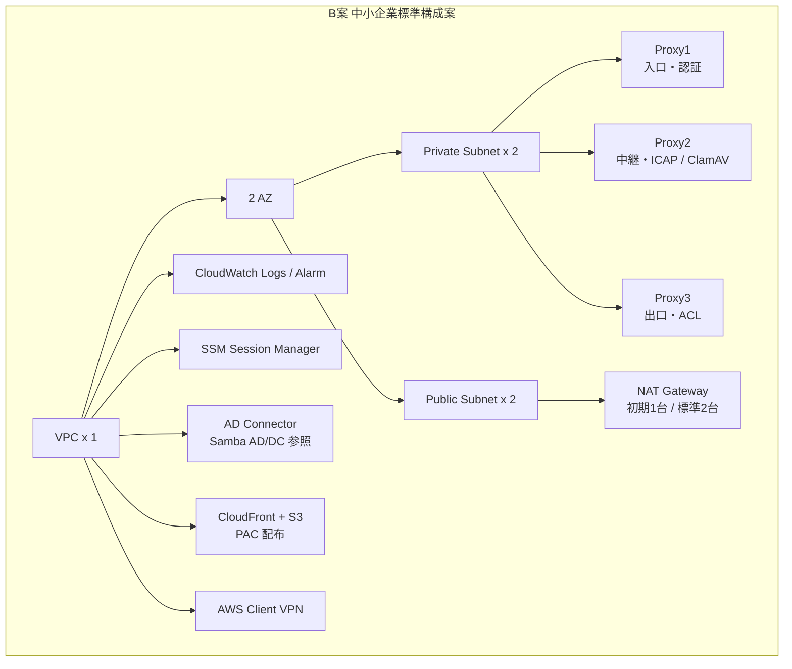
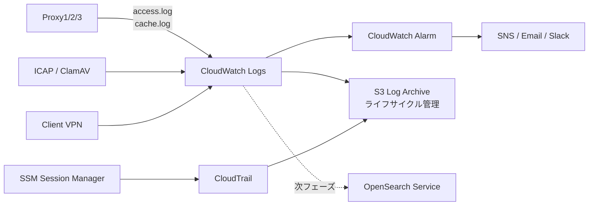
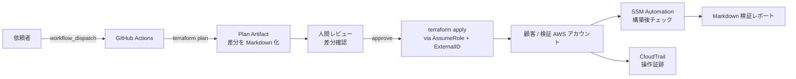

# AWS移行設計案：3段Proxy・認証・ログ基盤

Version: 2026-04-28
Author: gan2

> **本ページは、オンプレ / Docker Composeで構築した3段Proxy・認証・ログ基盤を、AWS上に移行する場合の設計案です。現時点ではAWS上での構築は未実施であり、次フェーズでTerraform / CloudFormation / Systems Manager Automation等によるIaC化・検証を進める予定です。**

---

## 0. このページの位置づけ

- 現行のオンプレ / Docker Compose構成（3段Proxy・認証・ログ基盤）を、AWS上に再構成する **設計案**
- AWS上での実構築は未実施。次フェーズで **Terraform / CloudFormation / SSM Automation によるIaC化と検証を予定**
- 中小企業（50〜300名）向け **B案（標準構成案）** を採用候補として提示
- 各構成判断には **可用性・セキュリティ・コスト・運用性のトレードオフ** を併記
- 表現原則：実装完了を断定する表現は使わず、「設計案」「検証予定」「次フェーズで構築予定」を用いる

---

## 1. 図で見る設計概要

### 1-1. 構成比較図

- **案A：単純移植** — Proxy 1台へ責務集約。低コストだが障害切り分け・拡張性が低い
- **案B：3段Proxy責務維持 + AWS運用最適化（採用）** — 入口/中継/出口の責務分離を AWS 上で維持
- **案C：監査強化** — OpenSearch / Security Hub / GuardDuty / AWS Config を組み合わせ、監査・証跡要件に対応

### 1-2. B案 AWS全体構成図

- **VPN（AWS Client VPN 想定）** で社内クライアントから VPC へ接続
- **PAC** は CloudFront + S3 で配布、社内 DIRECT / 外部 Proxy の経路を制御
- **AD Connector** で既存 **Samba AD/DC** の認証情報を参照（正本はオンプレ側に残置）
- **Proxy1 / Proxy2 / Proxy3** を Private Subnet に配置、責務分離を維持
- **CloudWatch Logs / Alarm**、**S3 Log Archive**、**SSM Session Manager** で運用と監査を担う

### 1-3. 通信フロー図

通信ステップ:
1. **Client起動** （Windows PC / Linux PC）
2. **VPN接続** （AWS Client VPN 経由で VPC へ到達）
3. **PAC取得** （CloudFront + S3 から `proxy.pac`）
4. **Proxy1 認証** （AD Connector 経由で Samba AD/DC に Kerberos / LDAP 問合せ）
5. **Proxy2 経路分岐** （内部 / 外部・検査要否で振り分け）
6. **ICAP検査** （ClamAV と連携、不正コンテンツ遮断）
7. **Proxy3 出口制御** （ACL に基づく宛先制限）
8. **NAT Gateway 経由で Internet へ HTTP / HTTPS 通信**
9. **CloudWatch Logs / S3 / SSM** で運用・監査・障害調査

### 1-4. レイヤー分解図

- **Client Layer** — 社内クライアント（Windows / Linux）
- **Access Layer** — AWS Client VPN（将来 Site-to-Site VPN 検討）
- **Control Layer** — PAC（CloudFront + S3）による経路判定
- **Auth Layer** — AD Connector + Samba AD/DC（将来 Managed Microsoft AD 検討）
- **Proxy Layer** — Proxy1 / Proxy2 / Proxy3（責務分離、ICAP / ClamAV 連携）
- **Egress Layer** — NAT Gateway による出口集約
- **Logging Layer**（横断観測）— CloudWatch Logs / Alarm、S3 Log Archive、SSM Session Manager

---

## 2. 現行オンプレ構成とAWS移行案の対応関係

| 現行オンプレ要素 | AWS移行案 | 採用理由 | 検証ポイント |
|---|---|---|---|
| Windows PC / WSL2 / Docker / VMware | クライアント側はそのまま、AWS には移さない | クライアント環境を変えずに段階移行できる | VPN クライアント配布、PAC 取得経路、社内端末ポリシー |
| 社内 LAN | AWS Client VPN（将来 Site-to-Site VPN） | クラウド側 VPC への安全な経路、社内 DIRECT との切替が可能 | Split Tunnel 設定、認証方式（証明書 / SSO）、帯域 |
| Samba AD/DC | **AD Connector で参照**（正本はオンプレ Samba AD/DC に残置） | 認証の正本を変えずに AWS リソースから AD を参照できる | DNS / Kerberos / 時刻同期、AD Connector 設置サブネット |
| dnsmasq / WPAD | **S3 + CloudFront による PAC 配布** | 静的配信で運用コスト低、CDN 配布でクライアント数増にも対応 | PAC キャッシュ TTL、HTTPS 配布、社内 DNS との整合 |
| Proxy1（入口・認証） | **EC2 + Squid（Proxy1）** | 既存 ACL / 認証ログ仕様を踏襲できる | AD Connector 連携、認証失敗ログの CW Logs 集約 |
| Proxy2（中継・分岐） | **EC2 + Squid（Proxy2）** | ICAP 連携・経路分岐の責務を維持 | ICAP 待ち時間、Proxy 間通信の SG 設計 |
| Proxy3（出口・ACL） | **EC2 + Squid（Proxy3）** | 出口 ACL の責務を維持し、NAT GW へ集約 | NAT GW のポート確保、宛先 ACL 反映フロー |
| stunnel（中継暗号化） | VPC 内通信は SG + Private Subnet で限定、外部終端は ACM / NLB TLS Listener 検討 | VPC ネイティブで暗号境界を再現、stunnel の運用負荷を削減 | TLS バージョン、証明書ローテーション運用 |
| ICAP / ClamAV | **EC2 上の ICAP / ClamAV** をサイドカー的に配置 | 既存検査ロジックを継続利用、将来サードパーティ AMI も検討 | 定義ファイル更新、メモリ使用率、スキャン遅延 |
| Zabbix（死活監視） | **CloudWatch Alarm**（必要に応じて Managed Grafana / Managed Prometheus） | マネージドで運用負荷を削減、SNS 通知へ接続容易 | アラーム閾値、誤検知率、通知先 |
| Graylog（全文検索） | **OpenSearch Service**（次フェーズで検討、初期必須にしない） | 監査・検索要件が出た段階で追加可能 | ノード数、ストレージ、ログ取り込みパイプライン |
| Loki（経路判定） | **CloudWatch Logs Insights** | 経路判定（access→cache）を CW Logs Insights で再現可能 | クエリ性能、ログ保存期間、コスト |
| 自動化（STEP0〜17 Bash） | **Terraform / CloudFormation + SSM Automation + GitHub Actions** | 宣言的構成で再現性を上げる、承認付き展開へ移行 | plan→apply の運用、ロールバック手順、ドリフト検出 |

---

## 3. 構成案A/B/Cの比較

> 採用は **B案（中小企業標準構成案）**。コストと可用性のバランスが良く、3段Proxy で OSS 構成の責務分離を維持しつつ、段階的に C案（監査強化）へ拡張可能。

| 軸 | 案A: 単純移植（PoC） | 案B: 3段Proxy + AWS運用最適化（採用） | 案C: 監査強化 |
|---|---|---|---|
| Proxy 構成 | 1 台（責務集約） | **3 段（Proxy1 / 2 / 3、2AZ）** | 3 段以上（2AZ） |
| NAT Gateway | 1 台 or NAT Instance | 標準 2 台（コスト優先時 1 台案） | 2 台 |
| ログ集約 | CloudWatch Logs のみ | CW Logs + S3 アーカイブ | CW Logs + S3 + OpenSearch |
| 認証 | AD Connector | AD Connector（Samba AD/DC 参照） | Managed AD + IAM Identity Center |
| 検査・監査 | なし | （任意）GuardDuty 検討 | Security Hub + GuardDuty + AWS Config |
| 可用性 | 低（AZ 障害でサービス断） | 中（2AZ で継続） | 中〜高 |
| 月額コスト目安 | 小 | 中 | 大 |
| 運用負荷 | 低（責務集約で切り分けが難しい） | 中 | 中〜高 |
| 監査性 | 最小限 | CW Logs + CloudTrail | フル監査ログ + 自動コンプラ評価 |
| 推奨場面 | 検証・学習・低リスク試験導入 | 50〜300 名の標準業務 | 監査・証跡・コンプライアンス要求 |

---

## 4. 採用構成：B案

| 構成要素 | 推奨値 | 理由 / トレードオフ |
|---|---|---|
| VPC | 1 | シンプル化と運用負荷低減 |
| AZ | 2 | 単一 AZ 障害で業務断を避ける |
| Public Subnet | 2 | NAT Gateway 配置用 |
| Private Subnet | 2 | 3 段 Proxy 配置、Subnet 跨ぎで AZ 障害を吸収 |
| Proxy EC2 | **3 段（Proxy1 / 2 / 3）** | OSS 構成の責務分離を AWS 上でも維持 |
| NAT Gateway | 初期 1 台 / 標準 2 台 | コスト優先か可用性優先かのトレードオフ |
| CloudWatch Logs | 必須 | アクセスログ集約・障害調査 |
| OpenSearch Service | 次フェーズで検討 | 初期は CW Logs Insights で代替、監査要件が明確化したら追加 |
| CloudWatch Alarm | 必須 | 異常検知 |
| SSM Session Manager | 必須 | 踏み台 EC2 を不要化、IAM 監査が効く |
| AD 連携 | AD Connector | 既存 Samba AD/DC を正本のまま AWS から参照 |
| PAC 配布 | CloudFront + S3 | 静的配信で運用コスト低 |
| クライアント接続 | AWS Client VPN | 将来は Site-to-Site VPN へ拡張検討 |

---

## 5. 採用構成の設計判断

### 5-1. なぜ3段Proxyを維持するのか

- **Proxy1：認証・入口制御** — AD 認証、初期 ACL、入口での識別
- **Proxy2：経路分岐・ICAP連携・将来拡張** — 内部 / 外部の振り分け、ICAP / ClamAV 連携、将来の検査機能の追加先
- **Proxy3：出口制御** — 宛先 ACL の最終チェック、NAT GW への集約点
- **目的は単純な冗長化ではなく、責務分離による障害切り分け** — どの段で問題が起きたかをログで切り分けられる構造を AWS 上でも維持する

### 5-2. なぜProxyをPrivate Subnetに置くのか

- **外部から直接アクセスさせない** — Proxy にグローバル IP を持たせない
- **VPN経由でのみ接続** — クライアントから Proxy への到達は AWS Client VPN を経由
- **Internet向け通信はNAT Gatewayに集約** — 出口を一点に絞ることで監査と制御を容易にする
- **Security Group で通信元・通信先を制限** — Proxy 間 / Proxy → NAT GW / Proxy → AD Connector 等を最小権限で限定

### 5-3. なぜPACを使うのか

- **社内通信は DIRECT** — VPC 内・社内向けは Proxy を経由せず効率化
- **外部通信は Proxy 経由** — インターネット向けのみ Proxy で集約制御
- **複数 Proxy への振り分け** — Proxy1 / Proxy2 / Proxy3 や将来の追加 Proxy へ動的に分配
- **障害時・検証時の経路切替** — PAC の差し替えのみで経路を切替可能

### 5-4. なぜAD Connectorを使うのか

- **認証の正本は Samba AD/DC に残す** — オンプレの ID 基盤を変更せずに移行
- **AWS 側は参照口として AD Connector を使う** — マネージドな AD 接続点を提供
- **Managed Microsoft AD は将来移行候補** — ID 基盤を AWS 側に集約する段階で再検討
- **連携検証は DNS / Kerberos / 時刻同期を含めて行う** — Kerberos 前提の SPN・逆引き・時刻ずれを検証対象とする

### 5-5. なぜCloudWatch / S3 / SSMを使うのか

- **CloudWatch Logs：ログ収集・障害調査** — Proxy / ICAP / VPN ログを統一的に集約
- **CloudWatch Alarm：異常検知** — 認証失敗率、出口エラー率、プロセス停止を即時検知
- **S3：長期保管・ライフサイクル管理** — Standard → Infrequent Access → Glacier で監査ログを安価に保管
- **SSM Session Manager：踏み台不要・SSH 鍵管理削減** — IAM 監査と CloudTrail で操作証跡を残せる

### 5-6. なぜB案を採用するのか

- **A案は低コストだが運用負荷が高い** — 1 台に責務が集中し、障害切り分けが難しい
- **C案は高機能だがコストと複雑性が高い** — 監査要件が明確でない段階では過剰
- **B案は既存の強みを維持しつつ AWS 運用へ最適化できる** — 3 段 Proxy の責務分離を残しつつ、ログ・監視・運用は AWS のマネージドへ寄せる
- **運用保守経験を AWS 設計に接続しやすい** — オンプレで身につけた切り分け観点をそのまま面接・実装で語れる

### 5-7. Well-Architected 6本柱との対応

| 柱 | 設計上の考慮 | 採用 / 検討する AWS サービス | トレードオフ |
|---|---|---|---|
| Operational Excellence | IaC化・実行前承認・構築後検証 | Terraform / CFn, SSM Automation, GitHub Actions | 自動化整備コスト vs 手動運用負荷 |
| Security | 最小権限 IAM・SG 最小化・SSM Session Manager・CloudTrail | IAM Identity Center, STS AssumeRole, CloudTrail | セキュリティ強化 vs 運用速度 |
| Reliability | Multi-AZ・Proxy 多段冗長・Alarm | Multi-AZ, CloudWatch Alarm | 冗長化コスト vs 単一障害許容 |
| Performance Efficiency | 適切なインスタンス・キャッシュ・スケール余地 | t3 / t3a / m6i, Squid キャッシュ | 過剰スペック vs 性能不足 |
| Cost Optimization | NAT GW 数・OpenSearch 段階導入・S3 ライフサイクル | Cost Explorer, Budgets, Compute Savings Plans | 可用性 vs 月額コスト |
| Sustainability | 低消費インスタンス・不要リソース削除 | Graviton (t4g / c7g), Instance Scheduler | 互換性検証コスト vs 消費電力削減 |

---

## 6. 運用・監視・ログ設計

- **ログ収集**: Proxy / ICAP / VPN すべて CloudWatch Logs に集約。障害時は時系列で経路を追える
- **ログ相関**: 認証失敗（407）→ ACL 拒否（403）→ ICAP 遮断 の順で切り分けるフローを CW Logs Insights で再現
- **長期保管**: S3 へ転送し、Standard → IA → Glacier でコスト最適化
- **異常検知**: CloudWatch Alarm（認証失敗率・出口エラー率・プロセス停止）→ SNS 通知
- **運用アクセス**: SSM Session Manager に統一し、踏み台 EC2・SSH 鍵を排除
- **監査**: すべての操作を CloudTrail に記録、S3 アーカイブと CloudTrail Insights を併用
- **次フェーズで検討**: OpenSearch Service / Managed Grafana / Managed Prometheus（要件が明確化したら追加）

---

## 7. EC2インスタンス選定とコスト最適化方針

> **以下は実測値ではなく、初期検証時の仮説** です。次フェーズの検証で実測ベースに更新予定。

| コンポーネント | 初期候補 | 起動方針 | 選定理由 | 監視項目 | 見直し条件 |
|---|---|---|---|---|---|
| **Proxy1** | t3.small または t3.medium | 常時起動 | 認証・入口制御を担当、AD 連携時の CPU / メモリを想定 | CPU / メモリ / 認証失敗数 | レイテンシ悪化、ピーク時にリソース不足 |
| **Proxy2** | t3.small または t3.medium | 常時起動 | 経路分岐・ICAP 連携を担当、ICAP 待ちが性能要因 | レイテンシ / ICAP 待ち / メモリ | ICAP 連携の応答遅延、検査スループット不足 |
| **Proxy3** | t3.small | 常時起動 | 出口制御中心、ACL 評価が主処理 | 通信量 / 拒否ログ / NAT 利用率 | 通信量増加、リソース不足 |
| **ICAP / ClamAV** | t3.medium 以上を検討 | 常時起動 | ClamAV はメモリを多く使用、定義ファイル更新が走る | メモリ使用率 / 定義ファイル更新 / スキャン遅延 | スキャン遅延が増えた場合 |
| **NAT Gateway** | 初期 1 台 | 常時起動 | コスト優先、可用性要件に応じて AZ ごとに配置 | バイトアウト / エラー率 / ポート使用率 | AZ 障害許容を上げる場合は 2 台化 |
| **AD Connector** | small / large | 常時起動 | 既存 Samba AD/DC を参照 | 接続失敗 / Kerberos エラー | ユーザー数増、レイテンシ悪化 |
| **AWS Client VPN** | 利用人数ベースで段階拡張 | 常時起動 | リモート接続の終端 | 同時接続数 / 認証失敗数 | リモート利用者の増減 |
| **OpenSearch Service** | 初期必須にしない | - | 監査・検索要件が出た段階で追加 | 検索レイテンシ / ストレージ使用率 | 検索要件の発生時 |
| **Managed Microsoft AD** | 初期必須にしない | - | ID 基盤を AWS へ移行する場合に検討 | - | ID 基盤刷新時 |

**コスト最適化方針**

- 初期は **1AZ + NAT Gateway 1 台** で検証
- 要件に応じて **2AZ 化 + NAT 2 台** に段階拡張
- **S3 ライフサイクル**（Standard → IA → Glacier）でログ保管コストを抑制
- **OpenSearch / Network Firewall は段階導入** — 初期は CW Logs Insights で代替
- PoC では **夜間停止 / Instance Scheduler** も検討
- ただし Proxy 経路は利用時間帯の通信前提となるため、**標準運用では常時起動を基本とする**

---

## 8. 次フェーズのIaC・自動化検討

> **「ボタン1つで構築完了」ではなく、「承認付きIaC展開フロー」** を目指します。
> 自動化の目的は楽をすることではなく、**安全に、レビュー可能に、再現性高く構築する** ことです。

**設計原則**

- **コード化対象**: VPC / Subnet / Route Table / Security Group / EC2 / IAM / CloudWatch（Terraform または CloudFormation）
- **起動方式**: GitHub Actions の `workflow_dispatch` で手動実行
- **レビュー必須**: `terraform plan` の差分を Artifact / PR コメントとして提示し、**人間が差分を確認してから apply**
- **顧客環境への展開**: Cross Account Role + External ID を検討、root ユーザや永続アクセスキーは使わない
- **監査**: すべての操作を CloudTrail で記録、S3 アーカイブ
- **構築後チェック**: SSM Automation Runbook で疎通・ログ・Alarm 状態を確認し、Markdown レポート化

**承認付きIaC展開フローのステップ案**

| Step | 操作 | 担当 | 出力 |
|---|---|---|---|
| 1 | workflow_dispatch でジョブ起動 | 依頼者 | Run ID |
| 2 | terraform plan を実行 | GitHub Actions | plan.txt / Markdown 要約 |
| 3 | plan を Artifact / PR コメントへ | GitHub Actions | レビュー対象 |
| 4 | 差分レビュー & 承認 | 人間（複数名推奨） | Approve |
| 5 | terraform apply（AssumeRole + External ID） | GitHub Actions | apply ログ |
| 6 | SSM Automation で構築後チェック | SSM Automation | テスト結果 JSON |
| 7 | CloudWatch Logs / Alarm 状態を確認 | SSM Automation | Markdown レポート |
| 8 | レポートを Artifact / Slack 通知 | GitHub Actions | レビュー証跡 |

---

## 9. 今後の検証ロードマップ

| Phase | 内容 | 成果物 |
|---|---|---|
| 1 | 設計図・対応関係表・判断ドキュメントの整備 | 本ページ（aws-deployment-plan.md） |
| 2 | Terraform 最小構成（VPC / Subnet / Proxy EC2 / NAT GW）を **次フェーズで構築予定** | terraform/ ディレクトリ |
| 3 | CloudWatch Logs / Alarm / SSM 接続検証 | 検証スクショ + Markdown |
| 4 | GitHub Actions workflow_dispatch + plan / apply 分離 | .github/workflows/aws-deploy.yml |
| 5 | クロスアカウント Role + External ID の検証 | role-trust-policy.json + 検証ログ |
| 6 | SSM Automation Runbook で構築後チェックを自動化 | runbook.yaml + サンプルレポート |
| 7 | EC2 インスタンスサイズの実測検証・コストレポート | CloudWatch Dashboard + 月次レポート |
| 8 | 面接用 1 枚図 / 10 分説明資料化 | interview-pitch.md / PPTX |

> 各 Phase は **次フェーズで検証予定** であり、現時点では Phase 1 完了段階。

---

## 10. 面接での説明ポイント

このAWS移行設計案で示したいのは、単に AWS サービス名を知っていることではなく、既存の OSS 3段Proxy で分離した「通信・認証・暗号化・ログ・監視」の責務を、AWS 上でも **可用性・セキュリティ・コスト・運用性** の観点で再設計できることです。

また、顧客アカウントへの展開についても、「ボタン1つで構築」ではなく、**最小権限・承認・監査・実行後検証** を含む **承認付きIaC展開フロー** として安全な導入を目指しています。

**話す順序の例（面接 5 分）**

| # | 話す内容 | 所要時間 | 着地点 |
|---|---|---|---|
| 1 | このページは「設計案」「AWS 上の構築は未実施・次フェーズで検証予定」 | 30秒 | 実装済みではなく **設計判断を整理した段階** であることを明示 |
| 2 | 構成比較図（01）→ B 案を採用した理由 | 1分 | 単純移植・監査強化との対比でコスト・可用性・運用負荷の判断軸 |
| 3 | B案 全体構成図（02）→ 3段Proxy で OSS の責務分離を AWS でも維持 | 1分 | VPC / 2AZ / Proxy1/2/3 / NAT / CW / AD Connector / PAC を一枚図で説明 |
| 4 | レイヤー分解図（04）→ Client / Access / Control / Auth / Proxy / Egress / Logging | 45秒 | レイヤ別責務分離と Logging Layer の横断観測 |
| 5 | 設計判断（5-1〜5-6）の中から 1〜2 点を深掘り | 1分15秒 | 例: 「なぜ 3 段を維持するのか」「なぜ AD Connector を選ぶのか」 |
| 6 | 承認付き IaC 展開フロー | 30秒 | 自動化＝楽ではなく、レビュー可能で再現性の高い展開を目指す |

**SAA / SOA 観点で語れること**

- **SAA（設計）** — VPC / Subnet / SG / NACL の責務分離、IAM Role 最小権限、Multi-AZ、NLB / Route 53 ルーティング選択、CloudWatch / OpenSearch の使い分け、Cost Optimization
- **SOA（運用）** — CloudWatch Logs / Metrics / Alarm を起点とした切り分けフロー、SSM Automation Runbook、Patch / Inventory による運用標準化、S3 ログ保管、障害時の確認手順、権限・監査の運用設計

---

## 関連ドキュメント

- [Index（設計意図・全体構成）](./index.html)
- [Verification（動作証跡）](./verification.html)
- [Automation（自動化・再現性）](./automation.html)
- [面接用ピッチ](./interview-pitch.html)
