# AWS 展開案：中小企業向け多段プロキシ・認証・ログ基盤

Version: 2026-04-28
Author: gan2

> **本ページは AWS 上に本構成を再設計する場合の設計案です。現時点では設計段階であり、今後 Terraform / CloudFormation / Systems Manager Automation 等による IaC 化・自動化検証を進める予定です。**

---

## 0. このページの位置づけ

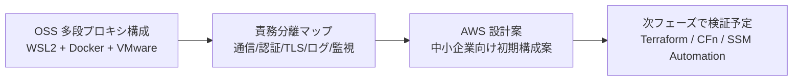

- OSS 多段プロキシ・認証・ログ基盤を AWS 上に再設計する **設計段階の検討案**
- 中小企業（50〜300名）向けの **初期構成案** を主体に、監査強化版まで段階拡張を想定
- 次フェーズで IaC 化と自動テストにより **再現性検証を進める予定**
- 各構成判断には **可用性・セキュリティ・コスト・運用性のトレードオフ** を必ず明記

---

## 1. 設計ゴール

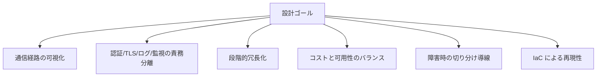

- 通信経路（クライアント → Proxy → 出口）が **どのログをたどれば追えるか** を設計に組み込む
- 認証・TLS・ログ・監視を **AWS サービス単位で責務分離** する
- 1AZ 1 台（PoC）から始めて 2AZ + 3 段 Proxy（Proxy1/2/3）へ拡張できる **段階的冗長化** を前提に設計する
- 最初から過剰なフルマネージド構成にせず、**コストと可用性のトレードオフ** を構成判断に反映する
- Terraform / CloudFormation / SSM Automation で **再現可能** な構成にする

---

## 2. 想定する中小企業モデル

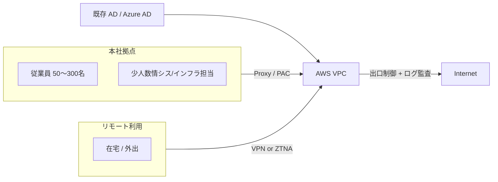

- 50〜300名規模、本社1拠点 + リモートアクセス（VPN または ZTNA）想定
- インターネット出口制御とログ監査が必要、ただし 24/365 SRE 体制ではない
- 既存 AD / Azure AD と ID 連携を前提（要件次第で IAM Identity Center を検討）
- 初期はコスト抑制を優先し、Multi-AZ・マネージドサービスは段階導入
- 監査強化要件があるときのみ OpenSearch / Security Hub / GuardDuty / AWS Config を追加検討

---

## 3. 全体アーキテクチャ図

> 中小企業向け標準構成案（B 案）として **3 段 Proxy（Proxy1: 入口 / Proxy2: 中継 / Proxy3: 出口）** を AWS 上でも維持し、OSS ポートフォリオで実装した責務分離を AWS のマネージド基盤で再構成する設計です。

### 3-1. 全体構成図

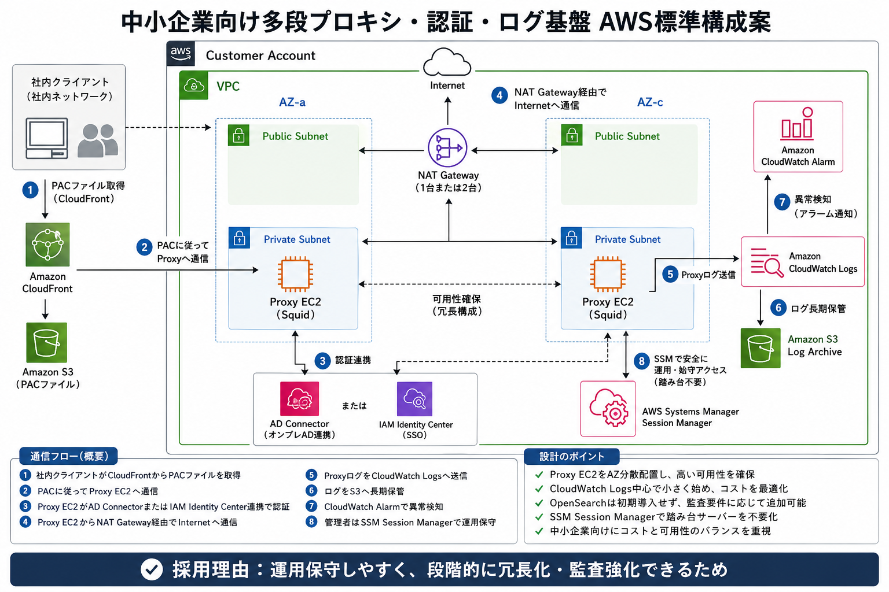

- Customer Account / VPC / 2AZ（AZ-a / AZ-c）に Public / Private Subnet を各 2 配置
- Private Subnet 内に **Proxy EC2 を 3 段（Proxy1 / Proxy2 / Proxy3）** で構成し、入口・中継・出口の責務を分離
- 出口は NAT Gateway 経由、PAC は CloudFront + S3 で配布
- 認証は AD Connector または Samba AD/DC（要件次第で Managed Microsoft AD / IAM Identity Center）
- 観測は CloudWatch Logs を起点に CloudWatch Alarm / S3 Log Archive、SSM Session Manager で運用

### 3-2. 通信フロー図

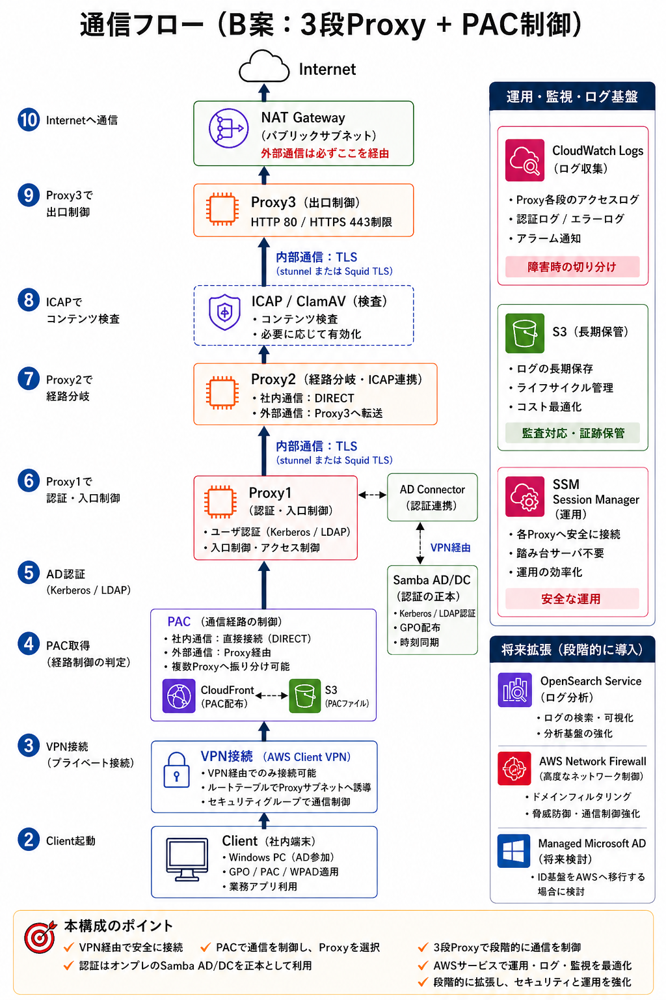

- Client は VPN（AWS Client VPN 想定）で VPC へ入り、PAC で経路を判定
- Proxy1（入口）→ Proxy2（中継 / ICAP / ClamAV 連携）→ Proxy3（出口）の順に処理
- 認証は AD（Kerberos / LDAP）で実施し、認可結果を Proxy1 で判定
- Proxy3 から NAT Gateway を経由してインターネットへ HTTP / HTTPS で到達
- 各段から CloudWatch Logs にアクセスログ／プロセスログを集約、S3 にアーカイブ

### 3-3. Z アーキテクチャ（レイヤ分解図）

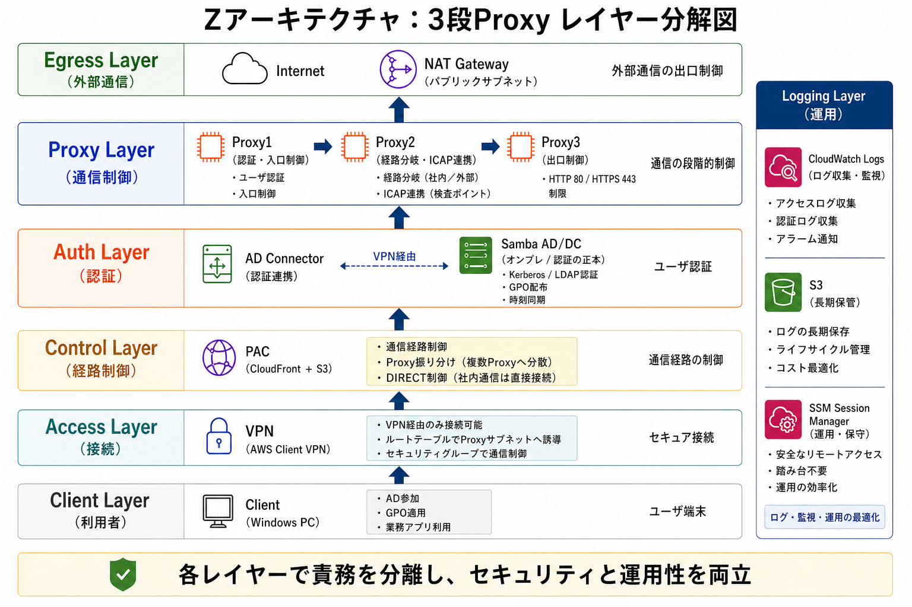

- **Egress / Proxy / Auth / Control / Access / Client** の 6 レイヤと **Logging Layer**（運用横断）に責務を分離
- レイヤ単位で「変更影響範囲」と「障害切り分け範囲」が定まる構造
- Logging Layer は CloudWatch Logs / S3 / Alarm / SSM で全レイヤを横断観測
- このレイヤモデルは Terraform / CloudFormation のモジュール分割単位にも対応させる想定

### 3-4. 運用・自動化フロー図

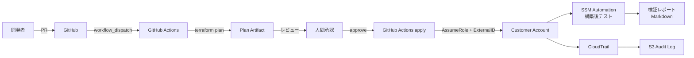

- IaC は **plan → 人間承認 → apply** の段階を必ず通す
- 顧客アカウントへは **クロスアカウント Role + External ID** でのみ到達
- 構築後は SSM Automation で疎通・ログ・Alarm を検証し Markdown レポート化
- すべての操作は CloudTrail で監査記録、S3 にアーカイブ

---

## 4. 推奨構成：中小企業向け標準構成案（B 案）

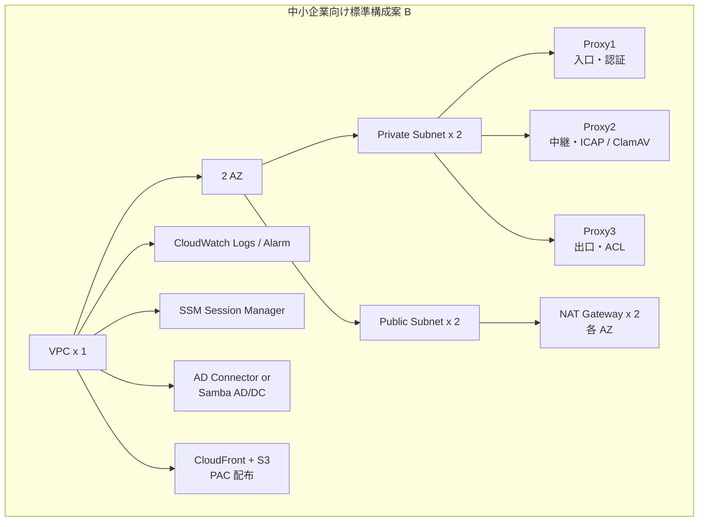

| 構成要素 | 推奨値 | 理由 / トレードオフ |
|---|---|---|
| VPC | 1 | シンプル化と運用負荷低減。マルチ VPC は規模拡大時に再検討 |
| AZ | 2 | 単一 AZ 障害で業務断を避ける。3AZ は中小企業向けでは過剰 |
| Public Subnet | 2 | NAT Gateway 配置用 |
| Private Subnet | 2 | 3 段 Proxy 配置、Subnet 跨ぎで AZ 障害を吸収 |
| Proxy EC2 | PoC 1 台 / 標準 3 段（Proxy1/2/3） | OSS ポートフォリオの **入口・中継・出口の責務分離** を AWS 上でも維持。1 台は検証用 |
| NAT Gateway | 標準 2 台（コスト優先で 1 台案） | 標準は各 AZ 配置で AZ 障害時の出口断を回避。コスト優先時は 1 台案も検討 |
| CloudWatch Logs | 必須 | アクセスログ・syslog の集約と検索、初期は CW Logs Insights で代替可 |
| OpenSearch Service | 段階導入 | 小規模ではコストが重く、CW Logs Insights で代替可能。監査要件が明確な場合のみ追加 |
| CloudWatch Alarm | 必須 | EC2 NW / 出口エラー率 / Proxy プロセス監視 |
| SSM Session Manager | 必須 | 踏み台 EC2 を不要化、IAM 監査が効く |
| AD 連携 | AD Connector / Samba AD/DC / Managed AD / IAM Identity Center | 既存 AD があれば AD Connector が低コスト、新規なら Managed AD、自前運用なら Samba AD/DC |
| PAC 配布 | CloudFront + S3 or 端末管理 | 端末管理が無ければ CloudFront + S3、Intune / Jamf があれば端末管理側へ寄せる |

**台数・構成の選定理由**

- **3 段 Proxy（Proxy1/2/3）**: OSS ポートフォリオで実装した「入口（認証）／中継（ICAP・暗号化）／出口（ACL）」の責務分離を AWS でも維持し、障害切り分け導線を共通化
- **PoC 時のみ 1 台**: 検証・学習用に責務集約。AZ 障害時の停止を許容できる場合のみ
- **NAT Gateway 標準 2 台**: 各 AZ 配置で AZ 障害時の出口断を回避。月額コスト増を許容
- **NAT Gateway 1 台案**: PoC や許容できる用途のみ。AZ-a 障害で AZ-c の Proxy も出口断する点を明示
- **OpenSearch を初期必須にしない理由**: 小規模ではコストが重く、CW Logs Insights で同等の検索が可能な範囲では不要

---

## 5. 構成パターン比較

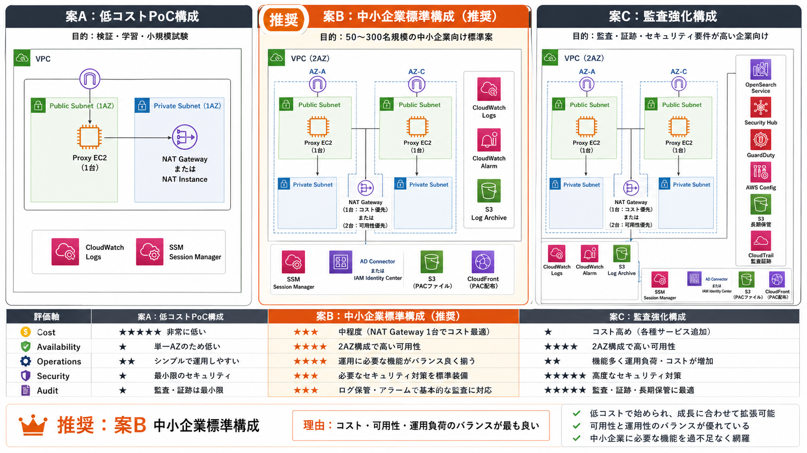

> **推奨は B 案（中小企業標準構成）**：コストと可用性のバランスが良く、3 段 Proxy で OSS 構成の責務分離を維持しつつ、段階的に C 案（監査強化）へ拡張可能。

| 軸 | パターン A: 低コスト PoC | パターン B: 中小企業標準（推奨） | パターン C: 監査強化 |
|---|---|---|---|
| Proxy EC2 | 1 台（責務集約） | 3 段（Proxy1 / 2 / 3、2AZ） | 3 段以上（2AZ） |
| NAT Gateway | 1 台 or NAT Instance | 2 台（各 AZ） | 2 台 |
| ログ集約 | CloudWatch Logs のみ | CW Logs + S3 アーカイブ | CW Logs + S3 + OpenSearch |
| 認証 | AD Connector | AD Connector / Samba AD/DC / Managed AD | Managed AD + IAM Identity Center |
| 検査・監査 | なし | （任意）GuardDuty 検討 | Security Hub + GuardDuty + AWS Config |
| 可用性 | 低（AZ 障害でサービス断） | 中（AZ 障害でも継続） | 中〜高 |
| 月額コスト目安 | 小 | 中 | 大 |
| 運用負荷 | 低 | 中 | 中〜高 |
| 監査性 | 最小限 | CW Logs + CloudTrail | フル監査ログ + 自動コンプラ評価 |
| 初期導入のしやすさ | ◎ | ○ | △（要件整理が必須） |
| 推奨場面 | 検証・学習・小規模試験導入 | 50〜300 名の標準業務 | 監査・証跡・コンプライアンス要求 |

**B 案を推奨する理由**
- OSS ポートフォリオの「入口・中継・出口」責務分離を AWS でも維持できる
- 運用保守がしやすく、段階的に C 案（OpenSearch / Security Hub 等）へ拡張できる
- NAT Gateway 2 台 + Multi-AZ で AZ 障害影響を最小化しつつ、コストは中規模に収まる

---

## 6. OSS 構成との対応表

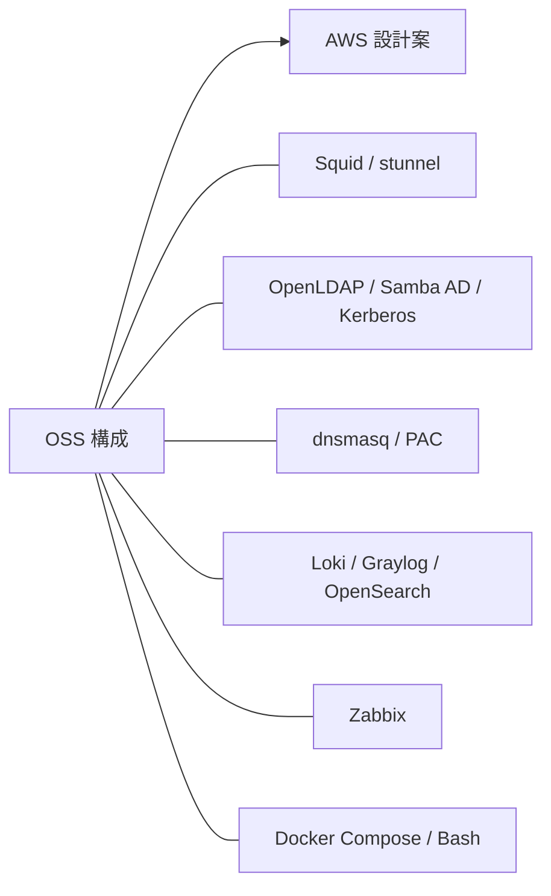

| OSS（現構成） | AWS 展開案 | 設計判断のポイント |
|---|---|---|
| Squid Proxy（Proxy1〜3） | EC2 上の Squid（基本案） / Network Firewall（出口制御特化時） | アクセスログ仕様や PAC 配布など Squid 固有挙動を残す場合は EC2、出口 ACL 集約だけなら Network Firewall も検討 |
| stunnel（中継暗号化） | VPC 内通信は SG + Private Subnet で限定、TLS 終端は ACM / NLB TLS Listener 検討 | stunnel 相当の責務は VPC + ACM の組合せに置換、必要なら NLB で TLS Listener |
| OpenLDAP / Samba AD / Kerberos | AWS Managed Microsoft AD / AD Connector / IAM Identity Center | 新規なら Managed AD、既存 AD があれば AD Connector、ユーザー単位 SSO は IAM Identity Center |
| dnsmasq / PAC | Route 53 Resolver / Route 53 Resolver DNS Firewall / S3 + CloudFront | DNS 解決は Resolver、ドメイン経路制御は DNS Firewall、PAC 配布は S3 + CloudFront か端末管理 |
| Loki / Graylog / OpenSearch | CloudWatch Logs / OpenSearch Service / S3 アーカイブ | 経路判定は CW Logs Insights、全文検索は OpenSearch、長期保管は S3 |
| Zabbix（TLS-PSK + Sidecar） | CloudWatch Alarm / Managed Grafana / Managed Prometheus | 死活監視は CW Alarm、ダッシュボードは Managed Grafana、メトリクス基盤は Managed Prometheus |
| Docker Compose | EC2 + AMI（最初は素直） / ECS（責務分離時） / Terraform / CloudFormation | 単純移植は EC2、責務単位の再設計時は ECS、宣言的構成は Terraform / CloudFormation |
| Bash 自動化（STEP0〜17） | Terraform / CloudFormation + SSM Automation + GitHub Actions | 構成変更は Terraform、構築後検証は SSM Automation、起動と承認は GitHub Actions workflow_dispatch |

---

## 7. Well-Architected 6 本柱との対応

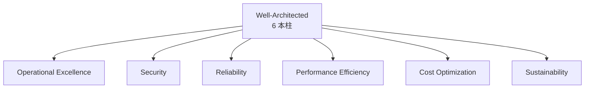

| 柱 | この設計で考慮すること | 採用 / 検討する AWS サービス | 次フェーズで検証予定 | トレードオフ |
|---|---|---|---|---|
| Operational Excellence | IaC 化・実行前承認・構築後検証・Runbook 化 | Terraform / CloudFormation, SSM Automation, GitHub Actions | plan → apply → 検証の自動レポート出力 | 自動化の整備コスト vs 手動運用負荷 |
| Security | 最小権限 IAM・クロスアカウント + External ID・SG 最小化・SSM セッション管理 | IAM Identity Center, STS AssumeRole, SSM Session Manager, CloudTrail | 一時 Role の自動失効、CloudTrail Insights | セキュリティ強化 vs 運用速度 |
| Reliability | Multi-AZ・Proxy 冗長・Alarm・自動復旧 | Multi-AZ, Auto Scaling（将来）, CloudWatch Alarm | EC2 自動復旧、ALB ヘルスチェック導入 | 冗長化コスト vs 単一障害許容 |
| Performance Efficiency | 適切なインスタンスタイプ・キャッシュ・スケール余地 | t3 / t3a / m6i, Squid キャッシュ, Auto Scaling | 負荷試験で適正サイジング | 過剰スペック vs 性能不足 |
| Cost Optimization | NAT GW 数・OpenSearch 段階導入・Savings Plans 検討 | Cost Explorer, Budgets, Compute Savings Plans | 月額コストレポートを CW Dashboard 化 | 可用性 vs 月額コスト |
| Sustainability | 低消費インスタンス（Graviton）・不要リソース削除・自動停止 | t4g / c7g (Graviton), Instance Scheduler | Graviton 移行検証、夜間停止 | 互換性検証コスト vs 消費電力削減 |

> 古い 5 本柱ではなく **6 本柱（Sustainability 含む）** で整理しています。

---

## 8. SAA / SOA 知識が活きるポイント

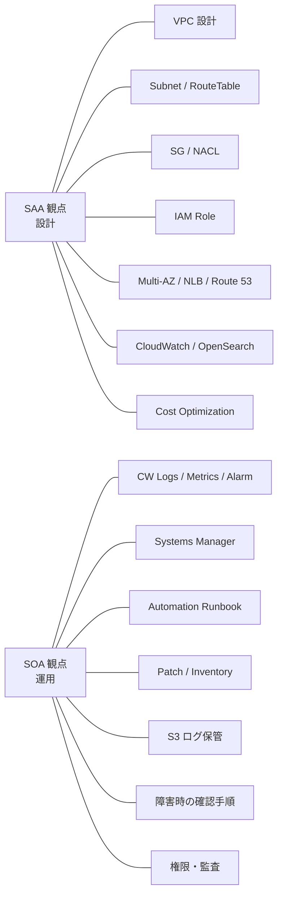

**SAA 観点（設計判断に効くポイント）**
- VPC / Subnet / Route Table / SG / NACL の責務分離設計
- IAM Role 最小権限、Multi-AZ 冗長化、NLB / Route 53 ルーティング選択
- CloudWatch / OpenSearch の使い分け、Cost Optimization の構成判断

**SOA 観点（運用判断に効くポイント）**
- CloudWatch Logs / Metrics / Alarm を起点とした切り分けフロー
- SSM Automation Runbook / Patch / Inventory による運用標準化
- S3 ログ保管・障害時確認手順・権限と監査の運用設計

---

## 9. 顧客アカウントへの安全な展開方式

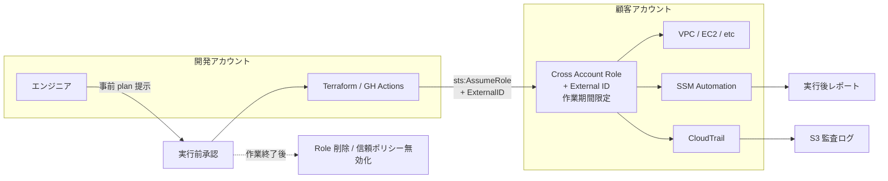

**禁止事項**
- 顧客 root ユーザーの利用
- 顧客アカウントに自分の IAM ユーザーを作成すること
- 永続的なアクセスキーの共有
- 管理者権限を恒常付与する運用
- 顧客環境への無承認の自動変更

**推奨事項**
- 顧客アカウント側で **作業期間限定の Cross Account Role** を作成
- **External ID** を必ず設定し、Confused Deputy を防ぐ
- ポリシーは Terraform / CloudFormation の対象リソースに限定した **最小権限**
- 作業ログは CloudTrail に集約し S3 へアーカイブ、CloudTrail Insights を有効化
- 作業前: Terraform plan を Markdown 化して提示し、人間が承認してから apply
- 作業後: SSM Automation で疎通・ログ・Alarm を確認し Markdown レポート化
- 作業終了時: Role を削除または信頼ポリシーから AssumeRole を外す

---

## 10. 承認付きセルフサービス構築フロー

> 「ボタン1つで構築」を **承認付きセルフサービス構築フロー（ワークフロー起動型の IaC 展開）** として実務寄りに再設計した案です。

```mermaid
graph LR
    DEV2[依頼者] -->|workflow_dispatch| GH2[GitHub Actions]
    GH2 -->|terraform plan| PLAN2[Plan Artifact<br/>Markdown 化]
    PLAN2 --> REV2[実行前承認<br/>人間レビュー]
    REV2 -->|approve| APPLY[terraform apply<br/>via AssumeRole + ExternalID]
    APPLY --> CUST3[顧客アカウント]
    CUST3 --> SSM4[SSM Automation<br/>構築後テスト]
    SSM4 --> CW2[CloudWatch Logs / Alarm 確認]
    CW2 --> RPT2[Markdown 検証レポート]
    RPT2 --> NOTIFY[Slack / Email 通知]
```

| Step | 操作 | 担当 / 主体 | 出力 |
|---|---|---|---|
| 1 | workflow_dispatch でジョブ起動 | 依頼者 | Run ID |
| 2 | Terraform plan を実行 | GitHub Actions | plan.txt / Markdown 要約 |
| 3 | plan を Artifact として PR / Issue にコメント | GitHub Actions | レビュー対象 |
| 4 | レビュー & 承認 | 人間（複数名推奨） | Approve |
| 5 | Terraform apply（AssumeRole + External ID） | GitHub Actions | apply ログ |
| 6 | SSM Automation で構築後テスト実行 | SSM Automation | テスト出力 JSON |
| 7 | CloudWatch Logs / Alarm 状態を確認 | SSM Automation | Markdown レポート |
| 8 | レポートを Artifact / Slack に通知 | GitHub Actions | レビュー証跡 |

---

## 11. 簡易テスト・動作テスト案

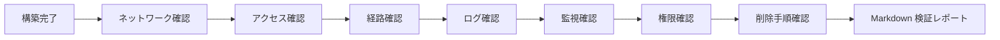

**構築後テスト項目（SSM Automation Runbook 想定）**

| カテゴリ | 確認項目 | 合格基準 |
|---|---|---|
| ネットワーク | VPC / Subnet / Route Table 作成 | terraform state list に存在 |
| ネットワーク | Proxy EC2 への TCP 疎通 | SSM Run Command で `nc -zv` 成功 |
| アクセス | SSM Session Manager で Proxy へログイン | start-session 成功 |
| 経路 | PAC ファイルが S3 / CloudFront から取得可能 | curl 200 OK |
| 経路 | Proxy 経由 HTTP / HTTPS が成功 | curl 経由でステータス 200 |
| ログ | アクセスログが CloudWatch Logs に転送 | LogGroup にイベント存在 |
| 監視 | Alarm が OK 状態 | describe-alarms で OK |
| 権限 | EC2 IAM Role が最小権限 | iam simulate-principal-policy で確認 |
| 削除 | terraform destroy でリソース削除 | state が空、CloudTrail に削除記録 |

**サンプル検証レポート（Markdown）**

```markdown
# AWS Deployment Verification Report
- Run ID: 2026-04-28-0001
- Account: 1234XXXXXXXX
- Region: ap-northeast-1
- Branch: feat/aws-deployment-design

## 1. ネットワーク
- VPC: OK 作成
- Subnet x 4: OK 作成
- NAT Gateway x 1: OK Active

## 2. Proxy
- EC2-a (Proxy): OK running, SSM connect OK
- EC2-c (Proxy): OK running, SSM connect OK
- HTTP via Proxy: OK 200
- HTTPS via Proxy: OK 200

## 3. ログ
- /aws/ec2/proxy/access.log: OK ingest (20 events / 5min)
- S3 archive bucket: OK object 出現

## 4. 監視
- Alarm "ProxyHighErrorRate": OK
- Alarm "NATPortAllocation": OK

## 5. 削除手順
- terraform destroy: OK Dry-run のみ実施

Reviewer: gan2
Approval: pending
```

---

## 12. 次フェーズの実装ロードマップ

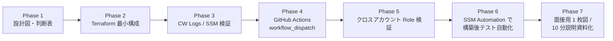

| Phase | 内容 | 成果物 |
|---|---|---|
| 1 | 設計図・判断表作成 | 本ページ（aws-deployment-plan.md） |
| 2 | Terraform 最小構成（VPC / Subnet / Proxy EC2 / NAT GW） | terraform/ ディレクトリ |
| 3 | CloudWatch Logs / Alarm / SSM 接続検証 | 検証スクショ + Markdown |
| 4 | GitHub Actions workflow_dispatch + plan / apply 分離 | .github/workflows/aws-deploy.yml |
| 5 | クロスアカウント Role + External ID 検証 | role-trust-policy.json + 検証ログ |
| 6 | SSM Automation Runbook で構築後テスト自動化 | runbook.yaml + サンプルレポート |
| 7 | 面接用 1 枚図 / 10 分説明資料化 | interview-pitch.md / PPTX 化 |

> 各 Phase は **次フェーズで検証予定** であり、現時点では Phase 1 完了段階です。

---

## 13. 面接での説明用まとめ

このAWS展開案で示したいのは、単にAWSサービス名を知っていることではなく、既存のOSS構成で分離した「通信・認証・暗号化・ログ・監視」の責務を、AWS上でも **可用性・セキュリティ・コスト・運用性** の観点で再設計できることです。

また、顧客アカウントへの展開についても、単なる自動構築ではなく、**最小権限・承認・監査・実行後検証** を含めた **承認付きセルフサービス構築フロー** として、安全な導入フローを設計することを目指しています。

**話す順序の例（面接 5 分）**
1. このページは「設計段階」「中小企業向け標準構成案（B 案）」（30秒）
2. 全体構成図（02）→ 3 段 Proxy で OSS の責務分離を AWS でも維持（1 分）
3. Z アーキテクチャ図（04）→ レイヤ別責務分離と Logging Layer の横断観測（45 秒）
4. 構成パターン A / B / C 比較（01）→ B 推奨理由とトレードオフ（1 分 15 秒）
5. Well-Architected 6 本柱で設計を裏付け（45 秒）
6. クロスアカウント + External ID + 承認付きセルフサービス構築フロー（45 秒）

---

## 関連ドキュメント

- [Index（設計意図・全体構成）](./index.html)
- [Verification（動作証跡）](./verification.html)
- [Automation（自動化・再現性）](./automation.html)
- [面接用ピッチ](./interview-pitch.html)
